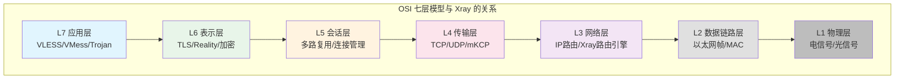
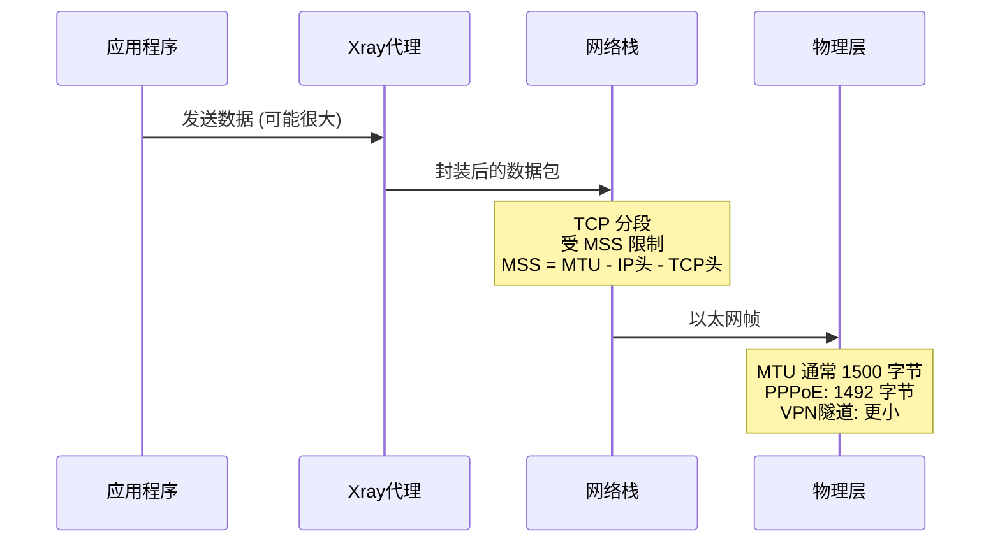
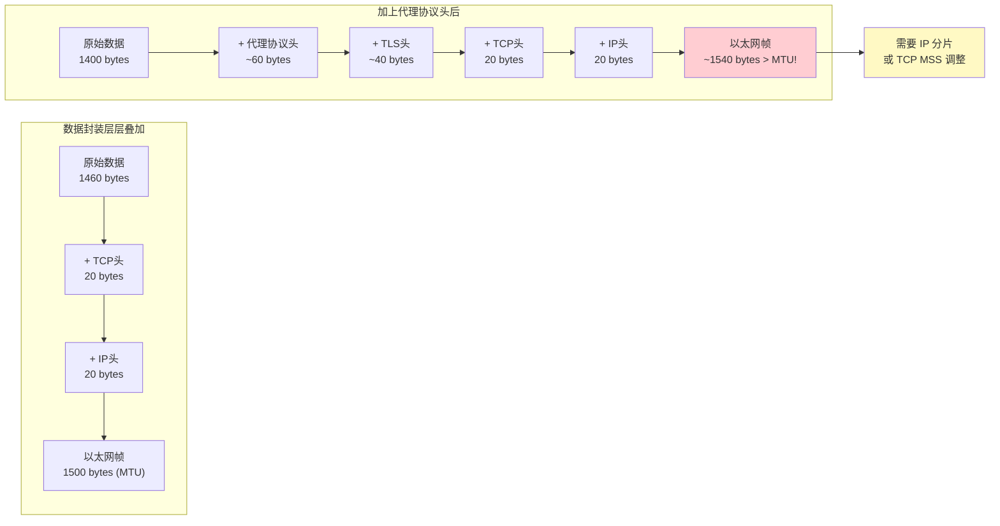

# 第一章：物理层与数据链路层（L1-L2）

> OSI 模型的最底两层——数据如何从比特流变成可寻址的帧

## 1.1 OSI 模型在代理场景中的位置



## 1.2 物理层（L1）：比特流传输

物理层负责在物理介质上传输原始比特流。在代理场景中，我们通常不直接操作这一层，但理解它对于理解 MTU（最大传输单元）限制至关重要。

### 1.2.1 关键概念

```
┌─────────────────────────────────────────┐
│              物理介质类型                  │
├─────────────────────────────────────────┤
│  以太网 (Ethernet)  → 铜缆/光纤          │
│  Wi-Fi (802.11)     → 无线电波            │
│  蜂窝网络 (4G/5G)   → 射频信号            │
│  卫星链路            → 微波信号            │
└─────────────────────────────────────────┘

每种介质都有不同的：
- 带宽上限
- 延迟特性
- 误码率
- MTU 限制
```

### 1.2.2 为什么代理协议需要关心物理层？



**关键洞察**：代理协议在应用层增加的头部开销会层层叠加，最终影响到底层的分段行为。这就是为什么设计协议时要尽量减小头部开销。

## 1.3 数据链路层（L2）：帧与寻址

### 1.3.1 以太网帧结构

```
┌──────────┬──────────┬──────────┬────────┬────────────┬─────┐
│ 前导码    │ 目的MAC  │ 源MAC    │ 类型   │  有效载荷   │ FCS │
│ 8 bytes  │ 6 bytes  │ 6 bytes  │ 2 bytes│ 46-1500    │4 B  │
└──────────┴──────────┴──────────┴────────┴────────────┴─────┘

类型字段:
  0x0800 = IPv4
  0x86DD = IPv6
  0x0806 = ARP
```

### 1.3.2 代码层面：Go 网络编程中的 L2 感知

在 Xray 核心中，虽然不直接操作 L2 帧，但 Go 的 `net` 包抽象了底层接口：

```go
// Go 标准库中获取网络接口信息
// 这展示了代理程序如何感知底层网络环境
package main

import (
    "fmt"
    "net"
)

func inspectInterfaces() {
    // 获取所有网络接口 — 对应 L2 层的网络适配器
    interfaces, _ := net.Interfaces()
    for _, iface := range interfaces {
        fmt.Printf("接口名: %s\n", iface.Name)
        fmt.Printf("  MAC 地址: %s\n", iface.HardwareAddr)
        fmt.Printf("  MTU: %d\n", iface.MTU)      // ← 关键！影响上层分包
        fmt.Printf("  标志: %v\n", iface.Flags)

        // 获取该接口绑定的 IP 地址 (L3)
        addrs, _ := iface.Addrs()
        for _, addr := range addrs {
            fmt.Printf("  IP 地址: %s\n", addr.String())
        }
    }
}

// 设计思路：
// Xray 需要知道网络接口信息来决定：
// 1. 绑定到哪个接口监听
// 2. MTU 大小 → 影响 mKCP 等传输层的分段策略
// 3. 是否支持 IPv6 → 影响连接策略
```

### 1.3.3 MTU 与代理协议的关系



**设计启示**：这就是为什么 VLESS 协议将头部设计得极其精简（最少只有 1+16+1 = 18 字节），而 VMess 因为认证和加密需要更大的头部开销。

## 1.4 与上层的衔接

L2 层通过 ARP 协议将 L3 的 IP 地址解析为 MAC 地址，完成帧的构建和发送。对于代理应用来说：

```
用户空间 (Xray)
    ↓ socket API
内核空间
    ↓ TCP/IP 协议栈
    ↓ 路由表查询 (L3)
    ↓ ARP 缓存/查询 (L2)
    ↓ 网卡驱动
硬件 (网卡/NIC)
    ↓ 物理信号 (L1)
网络
```

## 💡 本章思考题

1. 为什么在 VPN over VPN 的场景下，数据传输效率会显著下降？
2. 如果 MTU 设置不当会导致什么问题？这与代理协议的设计有什么关系？
3. 为什么 mKCP 传输方式需要自己实现分段而不依赖 TCP？

---
[下一章：网络层与路由 →](./02-network-layer.md)
