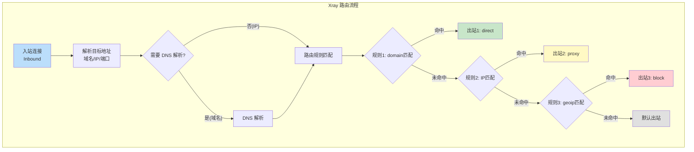
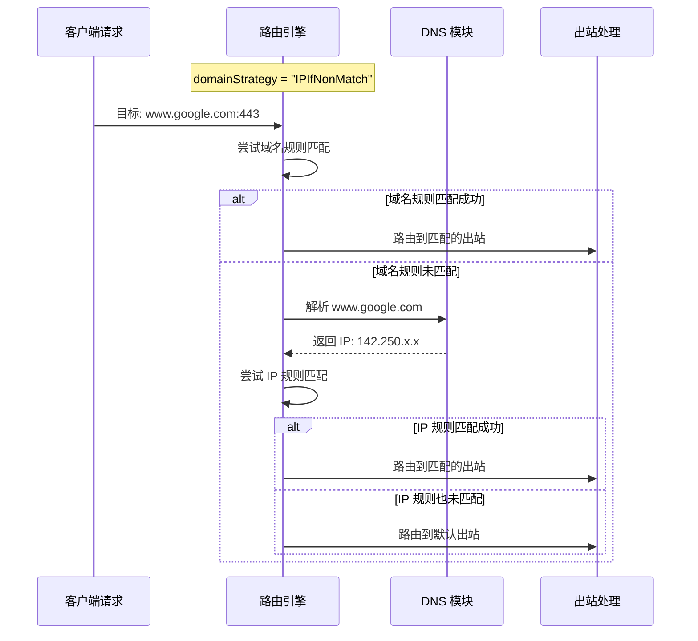
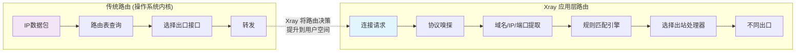

# 第二章：网络层与路由（L3）

> IP 路由的基本原理，以及 Xray 路由引擎如何在应用层实现智能分流

## 2.1 网络层基础

网络层（L3）的核心任务是**寻址**和**路由**——确定数据包从源到目的地的路径。

### 2.1.1 IP 数据包结构

```
IPv4 头部 (20-60 bytes)
┌───────┬───────┬───────────────┬───────────────────────┐
│版本(4)│头长(4)│ 服务类型(8)    │    总长度(16)          │
├───────┴───────┴───────────────┼────────┬──────────────┤
│         标识(16)               │标志(3) │ 片偏移(13)   │
├───────────────┬───────────────┼────────┴──────────────┤
│   TTL(8)      │  协议(8)      │    头部校验和(16)      │
├───────────────┴───────────────┴───────────────────────┤
│                   源 IP 地址(32)                       │
├───────────────────────────────────────────────────────┤
│                  目的 IP 地址(32)                      │
├───────────────────────────────────────────────────────┤
│                   选项(可变长)                         │
└───────────────────────────────────────────────────────┘

关键字段说明：
- TTL：每经过一个路由器减 1，防止数据包永远循环
- 协议：6=TCP, 17=UDP, 表明上层使用什么传输协议
- 源/目的 IP：端到端寻址，路由决策的关键依据
```

### 2.1.2 操作系统路由表

```go
// 模拟操作系统路由表查询过程
// 这是 L3 层路由的基础 —— Xray 的路由引擎在此之上构建

type RouteEntry struct {
    Destination net.IPNet  // 目标网段
    Gateway     net.IP     // 下一跳网关
    Interface   string     // 出口接口
    Metric      int        // 路由度量值（优先级）
}

// 路由查询：最长前缀匹配算法
func routeLookup(dst net.IP, table []RouteEntry) *RouteEntry {
    var bestMatch *RouteEntry
    bestPrefixLen := -1

    for i := range table {
        entry := &table[i]
        if entry.Destination.Contains(dst) {
            prefixLen, _ := entry.Destination.Mask.Size()
            if prefixLen > bestPrefixLen {
                // 最长前缀匹配：越精确的路由优先级越高
                // 例如 192.168.1.0/24 优先于 192.168.0.0/16
                bestMatch = entry
                bestPrefixLen = prefixLen
            }
        }
    }
    return bestMatch // nil 表示无匹配，使用默认路由
}

// 设计思路：
// 操作系统的路由表决定数据包从哪个接口发出
// Xray 在此之上增加了应用层路由：
// 根据域名、IP、协议、用户等维度做更精细的分流
```

## 2.2 Xray 路由引擎：应用层路由

Xray 的路由引擎工作在应用层，但模仿了 L3 路由的思想。它在操作系统路由决策之前，先在用户空间做一次"预路由"。

### 2.2.1 路由引擎架构



### 2.2.2 路由规则匹配的代码实现

```go
// Xray 路由引擎的核心数据结构和匹配逻辑
// 路径: app/router/router.go (简化版)

// RoutingRule 定义一条路由规则
type RoutingRule struct {
    // 匹配条件（任一条件匹配即视为规则匹配）
    DomainMatchers []DomainMatcher   // 域名匹配器
    CIDRMatchers   []CIDRMatcher     // IP CIDR 匹配器
    PortMatchers   []PortMatcher     // 端口匹配器
    ProtocolMatch  []string          // 协议嗅探匹配
    UserMatchers   []string          // 用户邮箱匹配
    InboundTag     []string          // 入站标签匹配

    // 匹配后的动作
    OutboundTag string              // 路由到哪个出站
}

// Router 路由器主体
type Router struct {
    rules          []*RoutingRule    // 有序规则列表
    domainStrategy DomainStrategy    // 域名解析策略
    defaultOutbound string           // 默认出站
}

// 路由决策过程
func (r *Router) PickRoute(ctx *RoutingContext) (string, error) {
    // 步骤1: 根据 domainStrategy 决定是否先解析域名
    if r.domainStrategy == AsIs {
        // "AsIs" 策略：不做 DNS 解析，直接用域名匹配
        // 优点：速度快，不泄露 DNS 查询
        // 缺点：无法按 IP 做路由决策
    } else if r.domainStrategy == IPIfNonMatch {
        // "IPIfNonMatch" 策略：先用域名匹配，
        // 如果没命中再解析为 IP 后重新匹配
        // 平衡了速度和精确度
    } else if r.domainStrategy == IPOnDemand {
        // "IPOnDemand" 策略：遇到 IP 规则时才解析
        // 最灵活但可能增加延迟
    }

    // 步骤2: 按顺序遍历规则，第一个匹配的生效
    for _, rule := range r.rules {
        if rule.Match(ctx) {
            return rule.OutboundTag, nil
        }
    }

    // 步骤3: 没有规则匹配，使用默认出站
    return r.defaultOutbound, nil
}

// 域名匹配的多种模式
type DomainMatcher interface {
    Match(domain string) bool
}

// 完整域名匹配: "full:example.com"
type FullDomainMatcher struct {
    Domain string
}
func (m *FullDomainMatcher) Match(domain string) bool {
    return domain == m.Domain
}

// 子域名匹配: "domain:example.com" 匹配 *.example.com
type SubdomainMatcher struct {
    Domain string
}
func (m *SubdomainMatcher) Match(domain string) bool {
    return domain == m.Domain ||
        strings.HasSuffix(domain, "."+m.Domain)
}

// 正则表达式匹配: "regexp:^ad\."
type RegexpMatcher struct {
    Pattern *regexp.Regexp
}
func (m *RegexpMatcher) Match(domain string) bool {
    return m.Pattern.MatchString(domain)
}
```

### 2.2.3 域名策略详解



## 2.3 GeoIP 与 GeoSite：大规模路由数据

### 2.3.1 GeoIP 数据库原理

```go
// GeoIP 使用 CIDR 列表来匹配 IP 地址所属的国家/地区
// 文件: app/router/condition_geoip.go (简化)

type GeoIPMatcher struct {
    countryCode string
    cidr4       []*net.IPNet  // IPv4 CIDR 列表
    cidr6       []*net.IPNet  // IPv6 CIDR 列表
}

// 匹配逻辑: 检查 IP 是否在某个国家的 IP 段内
func (m *GeoIPMatcher) Match(ip net.IP) bool {
    // 使用排序后的 CIDR 列表 + 二分查找
    // 比逐一遍历快得多
    cidrs := m.cidr4
    if ip.To4() == nil {
        cidrs = m.cidr6
    }

    // 二分查找匹配的 CIDR
    idx := sort.Search(len(cidrs), func(i int) bool {
        return bytesCompare(cidrs[i].IP, ip) > 0
    })

    // 检查前一个 CIDR 是否包含此 IP
    if idx > 0 && cidrs[idx-1].Contains(ip) {
        return true
    }
    return false
}

// 典型应用场景：
// "geoip:cn"    → 匹配中国大陆 IP → 直连
// "geoip:private" → 匹配私有 IP 段 → 直连或阻断
```

### 2.3.2 GeoSite 域名数据库

```go
// GeoSite 使用分类的域名列表进行匹配
// 例如 "geosite:cn" 包含中国大陆常用网站域名

type GeoSiteMatcher struct {
    category string
    domains  []DomainMatcher  // 包含 full/domain/regexp 等多种匹配器
}

// 数据来源: community 维护的域名分类列表
// 例如 "geosite:google" 包含:
//   full:google.com
//   domain:google.com       (匹配 *.google.com)
//   domain:googleapis.com
//   domain:googlevideo.com
//   domain:gstatic.com
//   ...
```

## 2.4 路由配置实例

```json
{
    "routing": {
        "domainStrategy": "IPIfNonMatch",
        "rules": [
            {
                "type": "field",
                "domain": ["geosite:category-ads-all"],
                "outboundTag": "block"
            },
            {
                "type": "field",
                "domain": ["geosite:cn"],
                "outboundTag": "direct"
            },
            {
                "type": "field",
                "ip": ["geoip:cn", "geoip:private"],
                "outboundTag": "direct"
            },
            {
                "type": "field",
                "port": "0-65535",
                "outboundTag": "proxy"
            }
        ]
    }
}
```

```
规则处理顺序（设计要点）：
┌─────────────────────────────────────────┐
│ 1. 广告域名 → 阻断                      │  ← 最高优先级
│ 2. 中国域名 → 直连                      │
│ 3. 中国 IP + 私有 IP → 直连             │
│ 4. 其他所有流量 → 代理                   │  ← 兜底规则
└─────────────────────────────────────────┘
设计思路：
- 规则按顺序匹配，第一个命中的生效
- 先处理已知分类（广告/国内），再用兜底规则
- domainStrategy="IPIfNonMatch" 保证域名和 IP 规则都能生效
```

## 2.5 L3 层与代理的交互



## 💡 本章思考题

1. 为什么 Xray 在应用层实现路由而不依赖操作系统路由表？
2. `domainStrategy` 的三种策略各有什么优缺点？在什么场景下应该选择哪种？
3. 如何设计路由规则来实现"国内直连、国外代理、广告拦截"？
4. 如果路由规则非常多（>10000条），应该如何优化匹配性能？

---
[← 上一章：物理层与数据链路层](./01-physical-datalink.md) | [下一章：传输层 →](./03-transport-layer.md)
