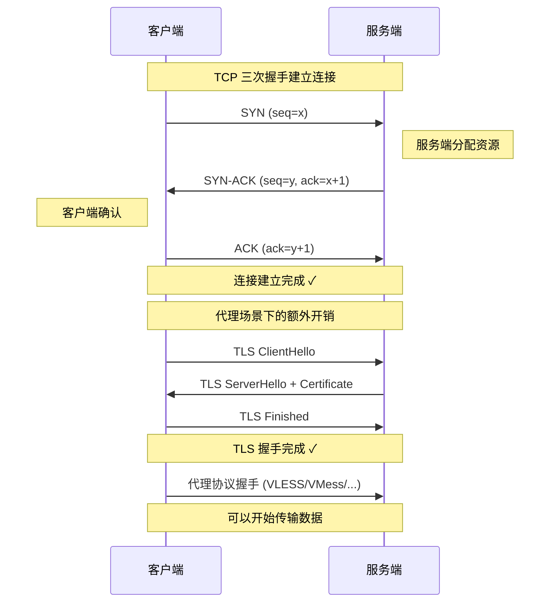
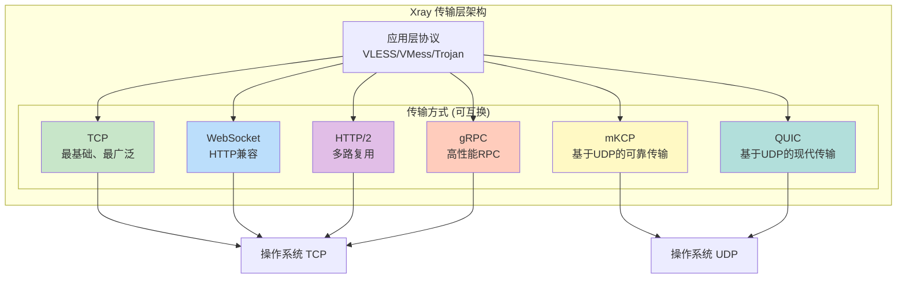
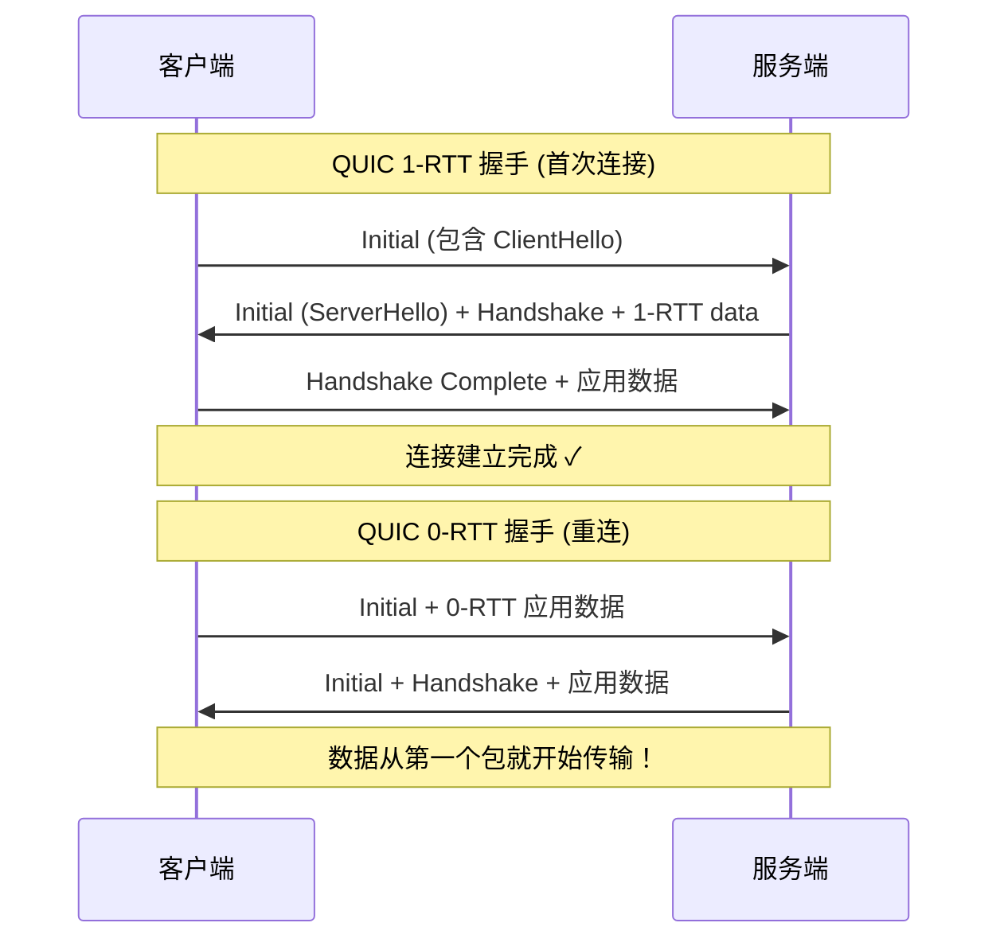

# 第三章：传输层（L4）

> TCP、UDP 以及 Xray 核心支持的各种传输方式的原理与设计思路

## 3.1 传输层基础

传输层（L4）为应用层提供端到端的数据传输服务。两个最重要的传输协议是 TCP 和 UDP。

### 3.1.1 TCP vs UDP

```
┌──────────────────┬────────────────────────────────────┐
│     特性          │     TCP          │     UDP         │
├──────────────────┼──────────────────┼─────────────────┤
│ 连接类型         │ 面向连接          │ 无连接          │
│ 可靠性           │ 可靠（重传机制）   │ 不保证          │
│ 有序性           │ 保证有序          │ 不保证          │
│ 流控制           │ 有（滑动窗口）     │ 无             │
│ 拥塞控制         │ 有               │ 无              │
│ 头部开销         │ 20-60 bytes      │ 8 bytes         │
│ 适用场景         │ 可靠数据传输       │ 实时/低延迟     │
└──────────────────┴──────────────────┴─────────────────┘
```

### 3.1.2 TCP 三次握手



**设计洞察**：每一层握手都增加了延迟（RTT）。这就是为什么现代协议设计追求**0-RTT**或**1-RTT**连接建立。

## 3.2 Xray 支持的传输方式

Xray 在 L4 之上实现了多种传输方式，每种都有不同的设计目标。

### 3.2.1 传输方式总览



### 3.2.2 TCP 传输

```go
// TCP 传输 — 最基础的传输方式
// 路径: transport/internet/tcp/hub.go (简化)

// TCP 监听器
type Listener struct {
    listener net.Listener
    config   *Config
}

func Listen(ctx context.Context, address net.Address, port net.Port,
    handler internet.ConnHandler) (*Listener, error) {

    // 步骤1: 创建 TCP 监听器
    listener, err := net.Listen("tcp", address.String()+":"+port.String())

    // 步骤2: 启动接受连接的 goroutine
    go func() {
        for {
            conn, err := listener.Accept()
            if err != nil {
                return
            }
            // 步骤3: 每个连接启动独立的 goroutine 处理
            // 这是 Go 并发模型的优势 — goroutine 轻量
            go handler(conn)
        }
    }()

    return &Listener{listener: listener}, nil
}

// TCP 拨号器
func Dial(ctx context.Context, dest net.Destination) (net.Conn, error) {
    // 使用系统 TCP 栈建立连接
    conn, err := net.DialTCP("tcp", nil, &net.TCPAddr{
        IP:   dest.Address.IP(),
        Port: int(dest.Port),
    })

    // 设计要点：可以在这里配置 TCP 选项
    conn.SetKeepAlive(true)           // TCP 保活
    conn.SetKeepAlivePeriod(30 * time.Second)
    conn.SetNoDelay(true)             // 禁用 Nagle 算法减少延迟

    return conn, nil
}
```

### 3.2.3 mKCP 传输：用户空间 UDP 可靠传输

```go
// mKCP 是 KCP 协议的 Xray 实现
// 在 UDP 之上构建可靠传输，可对抗高丢包网络环境
// 路径: transport/internet/kcp/ (简化)

// mKCP 数据段结构
type DataSegment struct {
    Conv        uint16    // 会话 ID — 标识连接
    Cmd         byte      // 命令类型: DATA/ACK/PING
    Opt         byte      // 选项标志
    Timestamp   uint32    // 发送时间戳 — 用于 RTT 计算
    SendingNext uint32    // 下一个待发送的序号
    RecvWindow  uint16    // 接收窗口大小 — 流控
    Count       byte      // 携带的分片数量
    Fragments   []Fragment // 数据分片
}

// mKCP 连接核心状态机
type Connection struct {
    conv          uint16           // 会话标识
    state         ConnState        // 连接状态
    sendQueue     *SendQueue       // 发送队列
    receiveQueue  *ReceiveQueue    // 接收队列
    roundTrip     *RoundTripInfo   // RTT 统计信息

    // 拥塞控制参数
    sendWindow    uint32           // 发送窗口
    remoteWindow  uint32           // 远端窗口
    congestionWindow uint32        // 拥塞窗口
}

// 可靠传输的核心：确认与重传
func (c *Connection) processAck(ack uint32) {
    // 从发送缓冲区中移除已确认的段
    c.sendQueue.Remove(ack)

    // 更新 RTT 估算（类似 TCP 的 Jacobson 算法）
    c.roundTrip.Update(time.Since(segmentSendTime))
}

func (c *Connection) retransmit() {
    // 重传超时的未确认段
    // 设计要点：mKCP 的重传更激进
    //   - 快速重传：收到2个跳跃ACK就重传
    //   - 不使用指数退避（TCP 的做法）
    //   - 用空间换时间，适合高延迟高丢包环境
    for _, seg := range c.sendQueue.Pending() {
        if seg.RetransmitTimeout() {
            c.send(seg)
            seg.IncrementRetransmitCount()
        }
    }
}

// 设计思路：
// mKCP 牺牲了带宽效率换取低延迟
// 通过配置 "uplinkCapacity" 和 "downlinkCapacity" 控制发包速率
// 伪装头部可模拟 DTLS/wireguard/视频通话等 UDP 流量特征
```

### 3.2.4 WebSocket 传输

```go
// WebSocket 传输 — HTTP 兼容的双向通信
// 设计目的：穿过只允许 HTTP 流量的防火墙/CDN
// 路径: transport/internet/websocket/ (简化)

// WebSocket 连接建立过程
func Dial(ctx context.Context, dest net.Destination) (net.Conn, error) {
    // 步骤1: 构建 WebSocket 升级请求
    // 这是一个标准的 HTTP GET 请求 + Upgrade 头
    header := http.Header{
        "Connection":            {"Upgrade"},
        "Upgrade":               {"websocket"},
        "Sec-WebSocket-Key":     {generateKey()},
        "Sec-WebSocket-Version": {"13"},
    }

    // 步骤2: 可以设置自定义 Host 和 Path
    // 这对于 CDN 转发和伪装非常重要
    wsURL := fmt.Sprintf("wss://%s%s", config.Host, config.Path)

    // 步骤3: 建立 WebSocket 连接
    conn, resp, err := websocket.Dial(wsURL, header)

    return conn, nil
}

// WebSocket 帧结构
// ┌───────┬──────┬───────────┬──────────────┬─────────┐
// │ FIN(1)│RSV(3)│ OpCode(4) │ Mask(1)      │Payload  │
// │       │      │           │ PayloadLen(7)│ Length  │
// ├───────┴──────┴───────────┼──────────────┤extension│
// │                          │ Extended     │         │
// │                          │ Payload Len  │         │
// ├──────────────────────────┼──────────────┤         │
// │      Masking Key (32)    │              │         │
// ├──────────────────────────┴──────────────┤         │
// │              Payload Data                │         │
// └──────────────────────────────────────────┴─────────┘
//
// 设计要点：
// - WebSocket 在 HTTP 之上运行，天然支持 CDN
// - 帧格式简单，开销较小
// - 但因为基于 TCP，仍受 TCP 队头阻塞影响
```

### 3.2.5 gRPC 传输

```go
// gRPC 传输 — 基于 HTTP/2 的高性能 RPC 框架
// 路径: transport/internet/grpc/ (简化)

// gRPC 利用 HTTP/2 的多路复用能力
// 在一个 TCP 连接上可以并发多个流

type GRPCService struct {
    // 服务名可自定义，用于伪装
    ServiceName string
}

// 设计优势：
// 1. HTTP/2 多路复用 — 一个连接承载多个代理会话
// 2. 天然支持 CDN（如 Cloudflare）
// 3. 头部压缩（HPACK）减少开销
// 4. 流控制机制防止一个流饿死其他流

// HTTP/2 帧结构
// ┌───────────────────────┐
// │  Length (24 bits)      │
// ├───────────┬───────────┤
// │ Type (8)  │ Flags (8) │
// ├───────────┴───────────┤
// │ Stream Identifier(31) │ ← 关键：流标识符实现多路复用
// ├───────────────────────┤
// │    Frame Payload      │
// └───────────────────────┘
//
// Type 类型：
//   DATA(0)     — 传输数据
//   HEADERS(1)  — HTTP 头部
//   SETTINGS(4) — 连接参数
//   PING(6)     — 保活/RTT 探测
//   GOAWAY(7)   — 优雅关闭
```

## 3.3 传输方式对比

```
┌────────────┬────────┬────────┬────────┬────────┬────────────┐
│ 传输方式    │ 协议栈  │ CDN    │ 抗丢包  │ 延迟    │ 典型用途    │
├────────────┼────────┼────────┼────────┼────────┼────────────┤
│ TCP        │ TCP    │ ✗      │ 一般    │ 低     │ 通用       │
│ mKCP       │ UDP    │ ✗      │ 强     │ 中     │ 高丢包网络  │
│ WebSocket  │ TCP    │ ✓      │ 一般    │ 中     │ CDN中转    │
│ HTTP/2     │ TCP    │ ✓      │ 一般    │ 中     │ 多路复用    │
│ gRPC       │ TCP    │ ✓      │ 一般    │ 中     │ CDN+多路复用│
│ QUIC       │ UDP    │ 部分   │ 强     │ 低     │ 现代传输    │
└────────────┴────────┴────────┴────────┴────────┴────────────┘
```

## 3.4 QUIC：下一代传输协议



```go
// QUIC 的核心优势（代码层面）
// 路径: transport/internet/quic/ (简化)

// QUIC 解决了 TCP 的核心问题

// 问题1: TCP 队头阻塞 (Head-of-Line Blocking)
// TCP 中一个包丢失会阻塞后续所有包
// QUIC 在 UDP 上实现多个独立流，流之间互不影响

type QUICStream struct {
    streamID  uint64
    // 每个流有独立的发送/接收缓冲
    // 流 A 的丢包不影响流 B
    sendBuf   []byte
    recvBuf   []byte
}

// 问题2: TCP 连接迁移
// TCP 使用 (srcIP, srcPort, dstIP, dstPort) 四元组标识连接
// 切换网络（WiFi→4G）会导致连接中断
// QUIC 使用 Connection ID 标识连接，不受 IP 变化影响

type QUICConnection struct {
    connectionID []byte  // 连接标识符
    // 即使客户端 IP 变了，服务端仍然认识这个连接
}

// 问题3: TLS 握手延迟
// TCP 需要先完成 TCP 握手，再完成 TLS 握手 = 2+ RTT
// QUIC 将传输握手和 TLS 握手合并 = 1 RTT（重连 0 RTT）
```

## 3.5 传输层配置示例

```json
{
    "transport": {
        "wsSettings": {
            "path": "/ws-path",
            "headers": {
                "Host": "example.com"
            }
        },
        "grpcSettings": {
            "serviceName": "GunService",
            "multiMode": true
        },
        "kcpSettings": {
            "mtu": 1350,
            "tti": 20,
            "uplinkCapacity": 50,
            "downlinkCapacity": 100,
            "congestion": true,
            "header": {
                "type": "wechat-video"
            }
        }
    }
}
```

## 💡 本章思考题

1. 为什么 QUIC 被认为是下一代传输协议？它相比 TCP 有哪些本质改进？
2. 在什么场景下应该选择 mKCP 而不是 TCP？
3. WebSocket 和 gRPC 传输方式都支持 CDN，它们的区别是什么？
4. TCP 队头阻塞问题在代理场景中会带来什么影响？

---
[← 上一章：网络层与路由](./02-network-layer.md) | [下一章：会话层 →](./04-session-layer.md)
