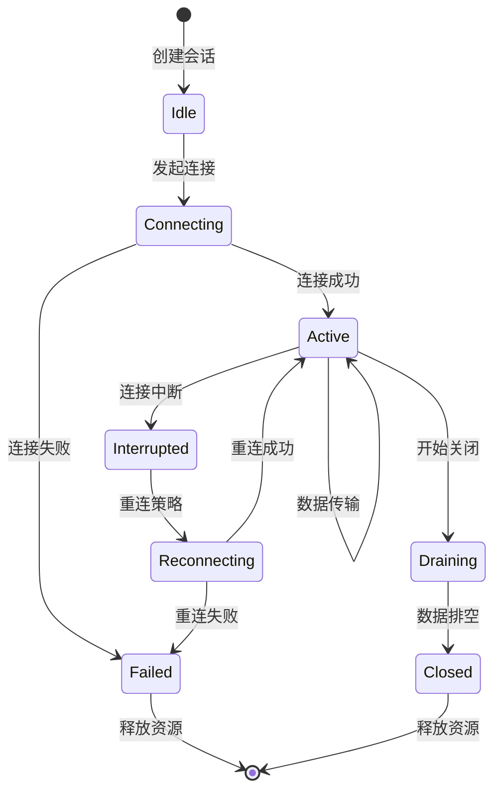
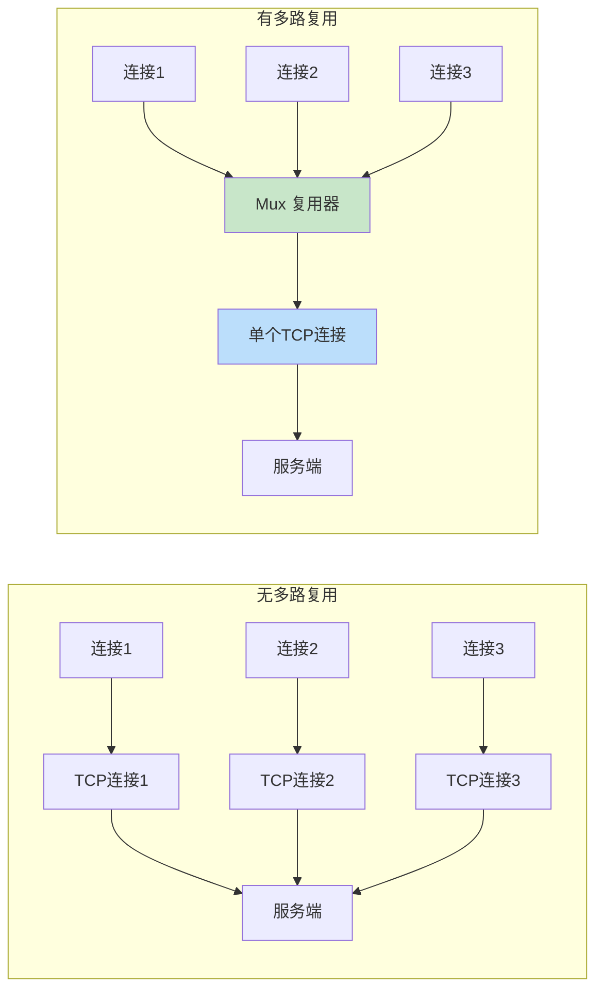
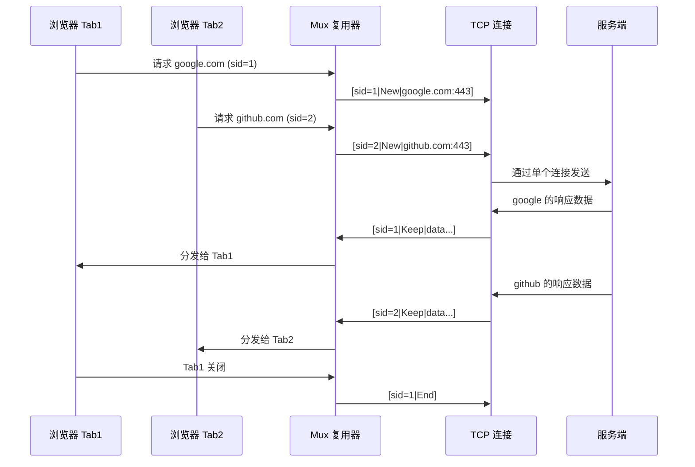

# 第四章：会话层（L5）

> 连接管理、多路复用、以及中断与重连机制

## 4.1 会话层的角色

会话层管理应用之间的会话（session）——建立、维护和终止通信。在 Xray 中，这对应于连接的生命周期管理和多路复用。

### 4.1.1 会话生命周期



### 4.1.2 会话管理代码结构

```go
// Xray 会话管理核心
// 路径: common/session/session.go (简化)

// Session 表示一个代理会话
type Session struct {
    ID       uint32           // 会话唯一标识
    Inbound  *Inbound         // 入站信息
    Outbound *Outbound        // 出站信息
    Content  *Content         // 内容元数据（协议、嗅探结果等）
}

// Inbound 入站会话信息
type Inbound struct {
    Source  net.Destination   // 来源地址
    Gateway net.Destination   // 网关地址
    Tag     string            // 入站标签（用于路由）
    User    *protocol.MemoryUser // 用户认证信息
}

// Outbound 出站会话信息
type Outbound struct {
    Target  net.Destination   // 目标地址
    Gateway net.Address       // 出站网关
}

// Content 内容信息
type Content struct {
    Protocol      string      // 嗅探到的协议(http/tls/...)
    SniffingResult *SniffResult
    Attributes    map[string]string
}

// 设计思路：
// Session 是 Xray 内部数据流转的核心
// 从入站收到连接 → 创建 Session → 路由决策 → 出站处理
// Session 携带了路由需要的所有上下文信息
```

## 4.2 多路复用（Mux）

多路复用是会话层最重要的功能之一。它允许多个逻辑连接共享一个物理连接。

### 4.2.1 为什么需要多路复用？



**多路复用的优势**：
1. 减少 TCP 握手次数（每个新连接不需要 3 次握手）
2. 减少 TLS 握手次数（不需要重新协商密钥）
3. 更好的连接复用（减少服务端资源消耗）
4. 降低总体延迟

### 4.2.2 Mux.Cool 协议

```go
// Mux.Cool 是 Xray 的多路复用协议
// 路径: common/mux/ (简化)

// Mux 帧头结构
type FrameMetadata struct {
    SessionID     uint16        // 子连接标识
    SessionStatus SessionStatus // 状态: New/Keep/End
    Option        byte          // 选项标志
    Target        net.Destination // 目标地址（仅 New 时携带）
}

// 帧类型
const (
    SessionStatusNew  = 0x01  // 新建子连接
    SessionStatusKeep = 0x02  // 数据传输
    SessionStatusEnd  = 0x03  // 关闭子连接
)

// Mux 帧的二进制格式
// ┌──────────────┬──────────────┬──────────┬──────────────┐
// │ SessionID(2) │  Status(1)   │ Option(1)│  Length(2)   │
// ├──────────────┴──────────────┴──────────┴──────────────┤
// │                   Payload (变长)                       │
// └───────────────────────────────────────────────────────┘
//
// 当 Status = New 时，Payload 包含：
// ┌───────────┬────────────────┬──────────────────────────┐
// │ AddrType  │ 目标地址        │ 目标端口                  │
// └───────────┴────────────────┴──────────────────────────┘

// 多路复用器客户端
type ClientWorker struct {
    sessionManager *SessionManager
    connection     net.Conn          // 底层物理连接
    done           chan struct{}
}

// 创建新的子连接
func (w *ClientWorker) Dispatch(dest net.Destination) (net.Conn, error) {
    // 步骤1: 分配 Session ID
    sid := w.sessionManager.Allocate()

    // 步骤2: 发送 New 帧
    meta := &FrameMetadata{
        SessionID:     sid,
        SessionStatus: SessionStatusNew,
        Target:        dest,
    }
    w.writeFrame(meta, nil)

    // 步骤3: 返回虚拟连接
    // 上层看到的是独立的 net.Conn，实际共享底层连接
    return &MuxConn{
        id:     sid,
        worker: w,
    }, nil
}

// 设计思路：
// Mux.Cool 在一个物理连接上创建多个逻辑通道
// 每个通道有独立的 SessionID
// 通道之间的数据通过帧头中的 SessionID 区分
// 类似 HTTP/2 的流 (Stream) 概念
```

### 4.2.3 多路复用的数据流



## 4.3 连接池管理

```go
// 连接池 — 复用已建立的连接
// 路径: transport/internet/system_dialer.go (简化)

type ConnectionPool struct {
    mu          sync.Mutex
    connections map[string][]*PooledConn  // key: 目标地址
    maxIdle     int                       // 最大空闲连接数
    maxLifetime time.Duration             // 连接最大生存时间
    idleTimeout time.Duration             // 空闲超时时间
}

type PooledConn struct {
    net.Conn
    createdAt time.Time
    lastUsed  time.Time
    inUse     bool
}

// 获取连接
func (p *ConnectionPool) Get(dest string) (net.Conn, error) {
    p.mu.Lock()
    defer p.mu.Unlock()

    // 步骤1: 尝试从池中获取空闲连接
    if conns, ok := p.connections[dest]; ok {
        for i, conn := range conns {
            if !conn.inUse && !conn.isExpired() {
                conn.inUse = true
                conn.lastUsed = time.Now()
                return conn, nil
            }
            // 清理过期连接
            if conn.isExpired() {
                conn.Close()
                conns = append(conns[:i], conns[i+1:]...)
            }
        }
    }

    // 步骤2: 池中无可用连接，创建新连接
    conn, err := net.Dial("tcp", dest)
    if err != nil {
        return nil, err
    }

    pooled := &PooledConn{
        Conn:      conn,
        createdAt: time.Now(),
        lastUsed:  time.Now(),
        inUse:     true,
    }
    p.connections[dest] = append(p.connections[dest], pooled)
    return pooled, nil
}

// 设计思路：
// 连接池避免了频繁的 TCP/TLS 握手
// 通过限制最大连接数防止资源泄漏
// 空闲超时和最大生命周期确保连接的健康度
```

## 4.4 流控制与背压

```go
// 流控制机制 — 防止快速发送方淹没慢速接收方
// 路径: common/buf/pipe.go (简化)

// Pipe 实现了带背压的数据管道
type Pipe struct {
    data    chan *Buffer    // 数据通道
    done    chan struct{}   // 完成信号
    option  PipeOption     // 管道选项
}

// 读取数据（带背压）
func (p *Pipe) ReadMultiBuffer() (MultiBuffer, error) {
    select {
    case buf := <-p.data:
        // 有数据可读
        return buf, nil
    case <-p.done:
        // 管道已关闭
        return nil, io.EOF
    }
}

// 写入数据（带背压）
func (p *Pipe) WriteMultiBuffer(mb MultiBuffer) error {
    select {
    case p.data <- mb:
        // 成功写入
        return nil
    case <-p.done:
        // 管道已关闭，释放数据
        mb.Release()
        return io.ErrClosedPipe
    }
    // 如果 data channel 已满，写入方会阻塞
    // 这就是背压机制：下游处理不过来时，上游自动减速
}

// 设计思路：
// Go 的 channel 天然提供了背压能力
// 当缓冲区满时，发送方被阻塞
// 这防止了内存无限增长
// 类似 TCP 的滑动窗口机制，但在应用层实现
```

## 4.5 会话超时与保活

```go
// 会话保活机制
// 长时间空闲的连接可能被中间设备（NAT、防火墙）断开

type SessionKeepAlive struct {
    interval time.Duration    // 保活间隔
    timeout  time.Duration    // 超时时间
    ticker   *time.Ticker
}

func (s *SessionKeepAlive) Start(conn net.Conn) {
    s.ticker = time.NewTicker(s.interval)

    go func() {
        for {
            select {
            case <-s.ticker.C:
                // 发送保活探测包
                // 设计要点：保活包应尽量小，不消耗带宽
                if err := sendPing(conn); err != nil {
                    // 保活失败 → 连接可能已中断
                    handleConnectionLost(conn)
                    return
                }
            }
        }
    }()
}

// 为什么需要应用层保活？
// 1. TCP keepalive 默认间隔很长（通常 7200 秒）
// 2. NAT 设备可能在 60-300 秒后清除映射
// 3. 某些防火墙会主动终止长时间空闲的连接
// 4. 应用层保活可以更快检测到连接中断
```

## 4.6 会话层总体架构

```
┌─────────────────────────────────────────────────┐
│                  会话管理器                       │
├─────────────────────────────────────────────────┤
│  ┌──────────┐  ┌──────────┐  ┌──────────┐      │
│  │ Session1 │  │ Session2 │  │ Session3 │      │
│  │ ID: 1    │  │ ID: 2    │  │ ID: 3    │      │
│  │ active   │  │ active   │  │ draining │      │
│  └────┬─────┘  └────┬─────┘  └────┬─────┘      │
│       │              │              │            │
│  ┌────┴──────────────┴──────────────┴──────┐    │
│  │           Mux 多路复用器                  │    │
│  │  SessionID ↔ 数据帧 映射                 │    │
│  └────────────────────┬────────────────────┘    │
│                       │                          │
│  ┌────────────────────┴────────────────────┐    │
│  │           连接池                          │    │
│  │  空闲连接 / 活跃连接 / 保活管理           │    │
│  └────────────────────┬────────────────────┘    │
│                       │                          │
├───────────────────────┴─────────────────────────┤
│              传输层 (TCP/UDP/QUIC)               │
└─────────────────────────────────────────────────┘
```

## 💡 本章思考题

1. 多路复用有什么缺点？在什么情况下不应该使用它？
2. 如何设计一个高效的连接池，同时考虑资源限制和性能？
3. 应用层保活和 TCP keepalive 有什么区别？各自适用于什么场景？
4. 背压机制为什么对代理服务器的稳定性至关重要？

---
[← 上一章：传输层](./03-transport-layer.md) | [下一章：表示层 →](./05-presentation-layer.md)
