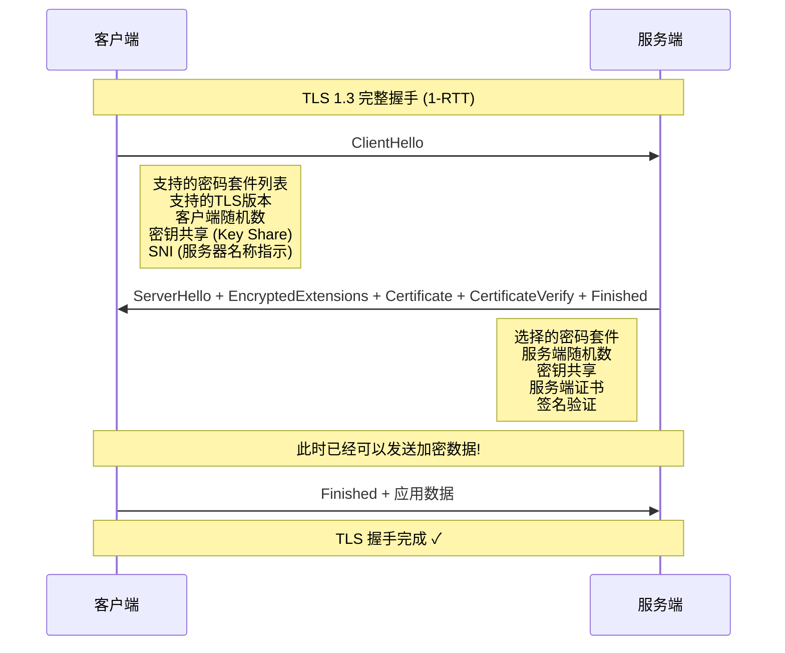
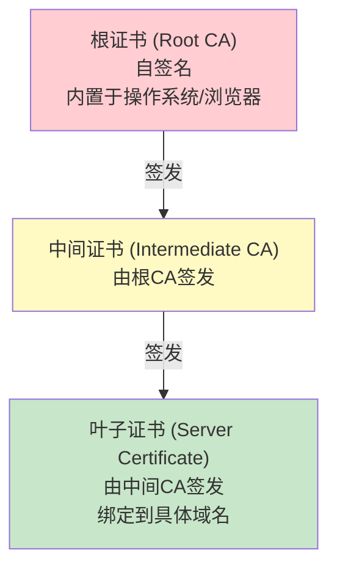
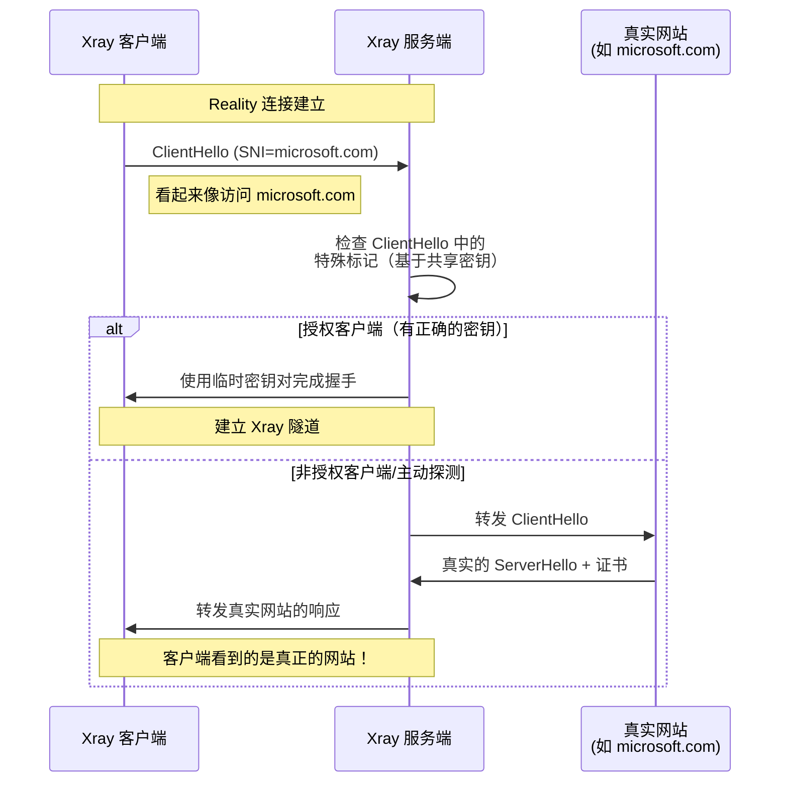

# 第五章：表示层（L6）

> TLS 握手、证书链验证、加密原理，以及 Reality/XTLS 等创新技术

## 5.1 表示层的角色

表示层负责数据的**表示方式**——编码、加密、压缩。在代理场景中，最重要的表示层功能是 **TLS 加密**。

## 5.2 TLS 协议深度解析

### 5.2.1 TLS 1.3 握手流程



### 5.2.2 TLS 握手代码实现

```go
// TLS 配置 — Xray 中的 TLS 设置
// 路径: transport/internet/tls/config.go (简化)

type TLSConfig struct {
    // 基本配置
    ServerName    string        // SNI — 服务器名称指示
    AllowInsecure bool          // 是否允许不安全证书（生产环境禁止！）
    ALPN          []string      // 应用层协议协商 ["h2", "http/1.1"]

    // 证书配置
    Certificates  []Certificate // 服务端证书列表
    CipherSuites  []uint16      // 密码套件列表

    // 高级选项
    MinVersion    uint16        // 最低 TLS 版本
    Fingerprint   string        // TLS 指纹伪装
}

// 构建 Go 标准库的 tls.Config
func (c *TLSConfig) BuildTLSConfig() *tls.Config {
    config := &tls.Config{
        // SNI: 告诉服务端客户端想连接哪个域名
        // 这是明文传输的！可以被中间人看到
        // 这就是为什么需要 ECH 或 Reality
        ServerName: c.ServerName,

        // 最低 TLS 版本: 强制使用 TLS 1.3
        MinVersion: tls.VersionTLS13,

        // ALPN: 协商应用层协议
        // "h2" = HTTP/2, "http/1.1" = HTTP/1.1
        NextProtos: c.ALPN,

        // 证书验证回调（高级用法）
        VerifyPeerCertificate: func(rawCerts [][]byte,
            verifiedChains [][]*x509.Certificate) error {
            // 自定义证书验证逻辑
            // 可以实现证书钉扎 (Certificate Pinning)
            return verifyCertificateChain(rawCerts)
        },
    }

    return config
}

// 设计思路：
// TLS 配置需要平衡安全性和兼容性
// 1. 强制 TLS 1.3 — 更安全，更少握手延迟
// 2. ALPN — 支持 HTTP/2 可以提升性能
// 3. 证书验证 — 防止中间人攻击
// 4. SNI — 必要但泄露目标域名，需要额外保护
```

## 5.3 证书链验证

### 5.3.1 PKI 证书信任链



### 5.3.2 证书验证代码

```go
// 证书链验证流程
// 路径: transport/internet/tls/config.go (简化)

func verifyCertificateChain(rawCerts [][]byte) error {
    // 步骤1: 解析证书
    certs := make([]*x509.Certificate, len(rawCerts))
    for i, raw := range rawCerts {
        cert, err := x509.ParseCertificate(raw)
        if err != nil {
            return fmt.Errorf("证书解析失败: %w", err)
        }
        certs[i] = cert
    }

    // 步骤2: 构建中间证书池
    intermediates := x509.NewCertPool()
    for _, cert := range certs[1:] {
        intermediates.AddCert(cert)
    }

    // 步骤3: 验证证书链
    opts := x509.VerifyOptions{
        Intermediates: intermediates,
        // 根证书使用系统内置的 (SystemCertPool)
        // 不需要手动指定
        CurrentTime: time.Now(),
    }

    // 步骤4: 执行验证
    chains, err := certs[0].Verify(opts)
    if err != nil {
        return fmt.Errorf("证书链验证失败: %w", err)
    }

    // 步骤5: 额外检查
    leaf := certs[0]

    // 检查证书是否过期
    if time.Now().After(leaf.NotAfter) {
        return errors.New("证书已过期")
    }

    // 检查域名是否匹配
    if err := leaf.VerifyHostname(expectedHost); err != nil {
        return fmt.Errorf("域名不匹配: %w", err)
    }

    // 检查证书用途
    if leaf.KeyUsage&x509.KeyUsageDigitalSignature == 0 {
        return errors.New("证书不支持数字签名")
    }

    return nil
}

// 证书验证的每一步都很关键：
// 1. 解析 — 确保证书格式正确 (X.509)
// 2. 链构建 — 从叶子证书回溯到受信任的根证书
// 3. 有效期 — 证书在有效期内
// 4. 域名匹配 — 证书确实属于目标域名
// 5. 用途检查 — 证书被授权用于此目的
// 6. 吊销检查 — 证书未被吊销 (OCSP/CRL)
```

### 5.3.3 证书钉扎（Certificate Pinning）

```go
// 证书钉扎 — 额外的安全层
// 不仅验证证书链，还验证具体的公钥指纹

type CertificatePinner struct {
    pins [][]byte  // 预期的公钥哈希列表
}

func (p *CertificatePinner) Verify(cert *x509.Certificate) error {
    // 计算证书公钥的 SHA-256 哈希
    pubKeyDER, err := x509.MarshalPKIXPublicKey(cert.PublicKey)
    if err != nil {
        return err
    }
    hash := sha256.Sum256(pubKeyDER)

    // 检查是否匹配任一钉扎的哈希
    for _, pin := range p.pins {
        if bytes.Equal(hash[:], pin) {
            return nil  // 匹配！
        }
    }
    return errors.New("证书公钥不在钉扎列表中")
}

// 设计思路：
// 即使 CA 被入侵，攻击者伪造了有效证书
// 证书钉扎仍然能检测到 — 因为公钥不匹配
// 这是深度防御的重要一环
```

## 5.4 加密原理

### 5.4.1 对称加密与非对称加密

```
┌─────────────────────────────────────────────────────┐
│                 TLS 混合加密体系                      │
├─────────────────────────────────────────────────────┤
│                                                      │
│  ┌──────────────────────────────┐                   │
│  │     非对称加密 (握手阶段)     │                   │
│  │  ECDHE — 密钥交换            │                   │
│  │  RSA/ECDSA — 身份验证        │                   │
│  │  优点: 无需预共享密钥          │                   │
│  │  缺点: 计算量大               │                   │
│  └──────────────┬───────────────┘                   │
│                 │ 协商出共享密钥                      │
│                 ↓                                    │
│  ┌──────────────────────────────┐                   │
│  │     对称加密 (数据阶段)       │                   │
│  │  AES-128-GCM / ChaCha20     │                   │
│  │  优点: 速度快                 │                   │
│  │  缺点: 需要安全地交换密钥     │                   │
│  └──────────────────────────────┘                   │
│                                                      │
└─────────────────────────────────────────────────────┘
```

### 5.4.2 AEAD 加密（认证加密）

```go
// AEAD = Authenticated Encryption with Associated Data
// 同时提供加密和完整性验证
// 路径: common/crypto/ (简化)

// AES-128-GCM 加密
func AESGCMEncrypt(key, nonce, plaintext, additionalData []byte) ([]byte, error) {
    // 步骤1: 创建 AES 块密码
    block, err := aes.NewCipher(key)
    if err != nil {
        return nil, err
    }

    // 步骤2: 创建 GCM 模式
    gcm, err := cipher.NewGCM(block)
    if err != nil {
        return nil, err
    }

    // 步骤3: 加密并附加认证标签
    // GCM 模式同时加密数据并计算 MAC
    // 输出 = 密文 + 16字节认证标签
    ciphertext := gcm.Seal(nil, nonce, plaintext, additionalData)

    return ciphertext, nil
}

// 解密并验证
func AESGCMDecrypt(key, nonce, ciphertext, additionalData []byte) ([]byte, error) {
    block, _ := aes.NewCipher(key)
    gcm, _ := cipher.NewGCM(block)

    // Open 同时验证 MAC 和解密
    // 如果数据被篡改，MAC 验证失败，返回错误
    plaintext, err := gcm.Open(nil, nonce, ciphertext, additionalData)
    if err != nil {
        // 数据被篡改或密钥错误
        return nil, errors.New("认证失败：数据可能被篡改")
    }

    return plaintext, nil
}

// 设计思路（为什么用 AEAD 而不是普通加密）：
// 1. 普通加密只保证机密性，不保证完整性
// 2. 攻击者可以修改密文，解密后得到不同的明文
// 3. AEAD 的认证标签检测到任何篡改
// 4. "先加密再MAC"的方案已被证明不如 AEAD 安全
```

## 5.5 XTLS / Vision：零拷贝加密

### 5.5.1 传统 TLS 代理的问题

```
传统方式（双重加密）：
应用数据 → [TLS加密(内层)] → [TLS加密(外层)] → 网络

问题：内层 TLS 数据已经被加密了，外层再加密是浪费 CPU！

┌─────────────────────────────────────────────┐
│ 外层 TLS 加密                                │
│  ┌─────────────────────────────────────┐    │
│  │ 内层 TLS 加密                        │    │
│  │  ┌───────────────────────────┐      │    │
│  │  │     原始数据               │      │    │  ← 三层封装！
│  │  └───────────────────────────┘      │    │
│  └─────────────────────────────────────┘    │
└─────────────────────────────────────────────┘
```

### 5.5.2 XTLS Vision 的解决方案

```go
// XTLS Vision — 识别内层 TLS 并跳过外层加密
// 大幅减少 CPU 开销

type XTLSVisionConn struct {
    net.Conn
    state    int           // 状态机状态
    reader   *bufio.Reader
}

// Vision 的核心：TLS 记录解析状态机
const (
    StateInit       = 0   // 初始状态
    StateHandshake  = 1   // TLS 握手阶段 — 需要加密
    StateData       = 2   // 数据传输阶段
    StatePadding    = 3   // 填充阶段
    StateDirect     = 4   // 直传阶段 — 跳过外层加密
)

func (c *XTLSVisionConn) Write(b []byte) (int, error) {
    switch c.state {
    case StateHandshake:
        // TLS 握手数据：必须使用外层加密
        // 因为握手数据包含敏感信息（证书、密钥交换）
        return c.encryptedWrite(b)

    case StateData:
        // 检测内层 TLS 记录类型
        if isTLSApplicationData(b) {
            // 内层已经是 TLS Application Data
            // 切换到直传模式
            c.state = StatePadding
        }
        return c.encryptedWrite(b)

    case StatePadding:
        // 添加填充，使流量模式不那么明显
        c.state = StateDirect
        return c.paddedWrite(b)

    case StateDirect:
        // 直接传输！跳过外层加密
        // 内层数据已经被 TLS 加密，无需二次加密
        return c.Conn.Write(b)
    }
    return 0, nil
}

// TLS 记录头解析
func isTLSApplicationData(b []byte) bool {
    if len(b) < 5 {
        return false
    }
    // TLS 记录格式:
    // byte 0: ContentType (23 = ApplicationData)
    // byte 1-2: Version (0x0303 = TLS 1.2/1.3)
    // byte 3-4: Length
    return b[0] == 23 && b[1] == 3 && b[2] == 3
}

// 设计思路（Vision 的创新）：
// 1. 解析流量中的 TLS 记录，识别握手/数据阶段
// 2. 握手阶段正常加密（保护敏感信息）
// 3. 数据阶段跳过外层加密（内层已加密）
// 4. 添加填充防止流量分析
// 5. 结果：CPU 开销接近零，吞吐量大幅提升
```

## 5.6 Reality：无需域名证书的 TLS

### 5.6.1 Reality 的设计动机

```
传统 TLS 代理的问题：
1. 需要拥有一个域名
2. 需要申请 TLS 证书（Let's Encrypt 等）
3. SNI 明文暴露目标域名
4. 证书可以被探测和识别

Reality 的解决方案：
1. 使用别人的域名和证书！
2. 对授权客户端：建立加密隧道
3. 对非授权客户端：回落到真实网站
4. 从外部看完全像正常的 HTTPS 访问
```

### 5.6.2 Reality 工作原理



```go
// Reality 服务端核心逻辑
// 路径: transport/internet/reality/ (简化)

type RealityServer struct {
    shortIDs   map[[8]byte]bool  // 授权的短 ID 列表
    privateKey [32]byte           // 服务端私钥
    dest       string             // 回落目标（真实网站）
}

func (s *RealityServer) HandleConnection(conn net.Conn) {
    // 步骤1: 读取 ClientHello
    clientHello := readClientHello(conn)

    // 步骤2: 从 ClientHello 的 SessionID 中提取认证信息
    // Reality 利用 TLS 1.3 的 session_id 字段（在 1.3 中未使用）
    // 来传递客户端的认证信息
    authInfo := extractAuthInfo(clientHello.SessionID, s.privateKey)

    // 步骤3: 验证客户端身份
    if !s.isAuthorizedClient(authInfo) {
        // 非授权客户端 → 回落到真实网站
        // 这使得主动探测无法区分 Reality 服务和真实网站
        s.fallbackToRealSite(conn, clientHello)
        return
    }

    // 步骤4: 授权客户端 → 建立 Reality 隧道
    // 使用 ECDH 密钥交换建立加密通道
    sharedSecret := ecdh(s.privateKey, authInfo.clientPublicKey)
    tunnel := newEncryptedTunnel(conn, sharedSecret)

    // 步骤5: 开始代理数据传输
    handleProxySession(tunnel)
}

// 设计思路（Reality 的安全保证）：
// 1. 无需自己的域名和证书
// 2. 使用知名网站的 SNI，流量特征完全一致
// 3. 主动探测只会得到真实网站的响应
// 4. 基于密码学的客户端认证（ECDH + shortID）
// 5. 中间人无法区分 Reality 流量和正常 HTTPS
```

## 5.7 TLS 指纹（Fingerprinting）

```go
// TLS 指纹 — 每个 TLS 实现有独特的"指纹"
// 检测方会通过 ClientHello 的特征来识别客户端类型

// ClientHello 中可被指纹识别的字段：
// 1. 支持的密码套件列表和顺序
// 2. 支持的扩展列表和顺序
// 3. 椭圆曲线参数
// 4. 签名算法
// 5. ALPN 协议列表
// 6. TLS 版本列表

// Xray 使用 uTLS 库来模拟各种浏览器的 TLS 指纹
type FingerprintConfig struct {
    Fingerprint string  // "chrome" / "firefox" / "safari" / "randomized"
}

func applyFingerprint(config *tls.Config, fp string) *utls.UConn {
    switch fp {
    case "chrome":
        // 模拟 Chrome 浏览器的 ClientHello
        return utls.UClient(conn, config,
            utls.HelloChrome_Auto)
    case "firefox":
        // 模拟 Firefox 的 ClientHello
        return utls.UClient(conn, config,
            utls.HelloFirefox_Auto)
    case "randomized":
        // 随机化指纹
        return utls.UClient(conn, config,
            utls.HelloRandomized)
    }
}

// 设计思路：
// Go 的 crypto/tls 库有独特的指纹
// 如果服务端检测到 Go 的 TLS 指纹而不是浏览器的
// 就知道这不是普通的浏览器访问
// uTLS 通过精确模拟浏览器的 ClientHello 来规避这种检测
```

## 💡 本章思考题

1. TLS 1.3 相比 TLS 1.2 做了哪些安全和性能改进？
2. Reality 如何做到"无需自己的证书"就能建立安全连接？
3. XTLS Vision 的直传模式会不会降低安全性？为什么？
4. TLS 指纹伪装的原理是什么？为什么 Go 的默认 TLS 实现容易被识别？

---
[← 上一章：会话层](./04-session-layer.md) | [下一章：应用层协议 →](./06-application-layer.md)
