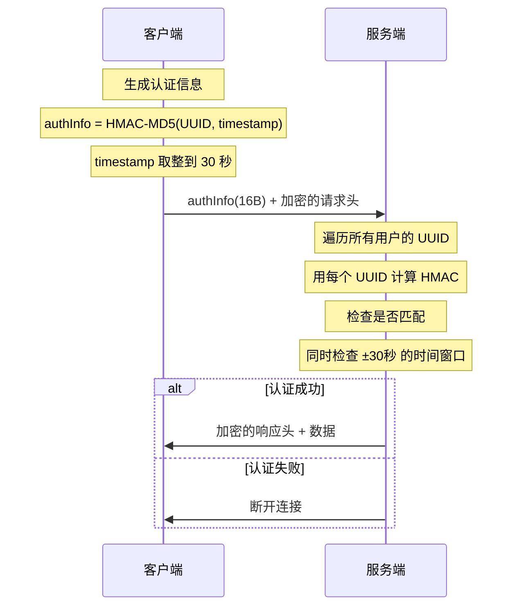
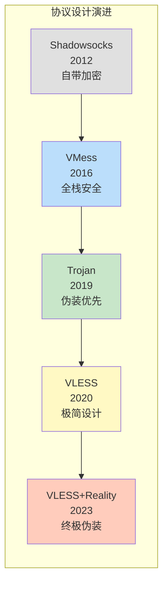

# 第六章：应用层协议（L7）

> VLESS、VMess、Trojan、Shadowsocks 等协议的设计思路与代码实现

## 6.1 应用层在代理中的角色

应用层协议定义了客户端和服务端之间的通信格式。在代理场景中，应用层协议负责：
1. **用户认证** — 验证客户端身份
2. **目标寻址** — 告诉服务端真正的目标地址
3. **数据封装** — 将原始数据封装为协议格式

## 6.2 VLESS 协议

VLESS 是 Xray 的旗舰协议，追求**极简设计**。

### 6.2.1 协议格式

```
VLESS 请求格式:
┌──────────┬──────────────────┬──────────┬─────────────────────┐
│ 版本(1B) │    UUID(16B)     │ 附加信息 │    指令部分          │
│  0x00    │  用户标识         │ 长度(1B) │                     │
│          │                  │ 内容(变长)│                     │
├──────────┴──────────────────┴──────────┼─────────────────────┤
│                   头部                  │       数据          │
│            最小 18 字节                 │     原始载荷        │
└─────────────────────────────────────────┴─────────────────────┘

指令部分:
┌──────────┬──────────┬──────────┬────────────┬──────────┐
│ 指令(1B) │ 端口(2B) │地址类型  │  地址       │          │
│ 0x01=TCP │ 大端序   │(1B)      │ (变长)     │          │
│ 0x02=UDP │          │1=IPv4    │IPv4: 4B   │          │
│          │          │2=域名    │域名: 1+NB  │          │
│          │          │3=IPv6    │IPv6: 16B  │          │
└──────────┴──────────┴──────────┴────────────┴──────────┘

VLESS 响应格式:
┌──────────┬──────────┬─────────────────────┐
│ 版本(1B) │ 附加信息 │       数据           │
│  0x00    │ 长度(1B) │     响应载荷         │
│          │ 内容(变长)│                     │
└──────────┴──────────┴─────────────────────┘
```

### 6.2.2 VLESS 实现

```go
// VLESS 协议处理
// 路径: proxy/vless/encoding/ (简化)

// VLESS 请求编码
func EncodeRequestHeader(header *RequestHeader, writer io.Writer) error {
    // 步骤1: 写入版本号
    // 版本 0 — VLESS 目前只有一个版本
    writer.Write([]byte{0})

    // 步骤2: 写入 UUID（16 字节）
    // UUID 是唯一的用户标识符
    // 不参与加密，仅用于身份验证
    writer.Write(header.User.Account.ID.Bytes())

    // 步骤3: 写入附加信息长度（用于扩展）
    writer.Write([]byte{0})  // 目前无附加信息

    // 步骤4: 写入指令
    writer.Write([]byte{byte(header.Command)})

    // 步骤5: 写入目标端口（大端序）
    binary.BigEndian.PutUint16(portBuf, uint16(header.Port))
    writer.Write(portBuf)

    // 步骤6: 写入目标地址
    writeAddress(writer, header.Address)

    return nil
}

// VLESS 请求解码（服务端）
func DecodeRequestHeader(reader io.Reader) (*RequestHeader, error) {
    // 步骤1: 读取版本号
    version, _ := readByte(reader)
    if version != 0 {
        return nil, errors.New("不支持的 VLESS 版本")
    }

    // 步骤2: 读取并验证 UUID
    var uuid [16]byte
    io.ReadFull(reader, uuid[:])

    // 在服务端的用户列表中查找此 UUID
    user, found := userValidator.Get(uuid)
    if !found {
        return nil, errors.New("未知的用户 UUID")
    }

    // 步骤3: 跳过附加信息
    addonLen, _ := readByte(reader)
    if addonLen > 0 {
        io.CopyN(io.Discard, reader, int64(addonLen))
    }

    // 步骤4: 读取指令和目标地址
    command, _ := readByte(reader)
    port := readPort(reader)
    address := readAddress(reader)

    return &RequestHeader{
        User:    user,
        Command: command,
        Port:    port,
        Address: address,
    }, nil
}

// 设计思路（VLESS 的极简哲学）：
// 1. 无加密：加密由传输层(TLS)负责，避免重复加密
// 2. 无时间戳：不依赖时间同步，避免时钟偏差问题
// 3. 无 HMAC：身份验证由 UUID 匹配完成，简单直接
// 4. 头部极小：最少 18 字节，减少特征和开销
// 5. 依赖外层安全：必须配合 TLS/Reality 使用
```

## 6.3 VMess 协议

VMess 是 V2Ray 时代的经典协议，内置完整的加密和认证机制。

### 6.3.1 VMess 认证过程



### 6.3.2 VMess 协议实现

```go
// VMess 请求格式（加密后）
// 路径: proxy/vmess/ (简化)

// 认证信息生成
func generateAuthInfo(uuid [16]byte) [16]byte {
    // 步骤1: 获取当前时间戳（精确到秒）
    timestamp := time.Now().Unix()

    // 步骤2: 使用 HMAC-MD5 生成认证信息
    // Key = UUID, Message = timestamp
    hmacHash := hmac.New(md5.New, uuid[:])
    binary.Write(hmacHash, binary.BigEndian, timestamp)

    var auth [16]byte
    copy(auth[:], hmacHash.Sum(nil))
    return auth

    // 设计要点：
    // 使用时间戳防止重放攻击
    // 服务端会检查 ±30秒 范围内的所有可能时间戳
    // 这要求客户端和服务端时间同步（误差 < 30秒）
}

// VMess 请求头（加密前的明文）
type VMeSSRequestHeader struct {
    Version     byte     // 版本号
    IV          [16]byte // 数据加密的初始向量
    Key         [16]byte // 数据加密的密钥
    ResponseAuth byte    // 响应认证值
    Option      byte     // 选项: 是否使用分块传输等
    Security    byte     // 加密方式: AES-128-GCM / ChaCha20 / None
    Command     byte     // 指令: TCP / UDP
    Port        uint16   // 目标端口
    Address     []byte   // 目标地址
}

// 请求头加密
func encryptRequestHeader(header *VMeSSRequestHeader,
    uuid [16]byte) []byte {

    // 步骤1: 从 UUID 派生请求头加密密钥
    // Key = MD5(UUID + "c48619fe-8f02-49e0-b9e9-edf763e17e21")
    cmdKey := md5Hash(uuid[:], []byte(magicString))

    // 步骤2: 使用 AES-128-CFB 加密请求头
    // IV = MD5(timestamp * 4)
    iv := md5Hash(timestampBytes(4))
    stream := cipher.NewCFBEncrypter(aesCipher(cmdKey), iv)

    // 步骤3: 加密
    encrypted := make([]byte, len(headerBytes))
    stream.XORKeyStream(encrypted, headerBytes)

    return encrypted
}

// VMess 数据加密（以 AES-128-GCM 为例）
func encryptData(data []byte, key, iv []byte) []byte {
    // 每个数据块的格式:
    // ┌──────────┬──────────────┬──────────┐
    // │长度(2B)  │ 加密数据      │ 认证标签 │
    // │          │              │ (16B)    │
    // └──────────┴──────────────┴──────────┘

    // 使用 AES-128-GCM 加密
    block, _ := aes.NewCipher(key)
    gcm, _ := cipher.NewGCM(block)

    // Nonce 从 IV 派生，每个块递增
    nonce := deriveNonce(iv, blockCount)

    return gcm.Seal(nil, nonce, data, nil)
}

// 设计思路（VMess 的全栈安全）：
// 1. 自带认证：基于 UUID + 时间戳的 HMAC
// 2. 自带加密：支持多种加密算法
// 3. 防重放：时间戳 + 使用过的认证信息缓存
// 4. 缺点：头部开销大、依赖时间同步、MD5 已不推荐
// 5. 历史意义：开创了代理协议的安全设计范式
```

## 6.4 Trojan 协议

Trojan 的设计思路完全不同——**伪装成正常的 HTTPS 流量**。

### 6.4.1 Trojan 的设计哲学

```
传统代理协议:
  [自定义协议头] + [加密数据] → 有独特的流量特征

Trojan 的方式:
  [TLS加密] → [密码哈希] + [CRLF] + [目标地址] + [数据]
  从外部看就是普通的 HTTPS 连接

设计思想: 与其发明新的加密方式，不如完全依赖 TLS
          把自己伪装成最普通的 HTTPS 流量
```

### 6.4.2 Trojan 协议实现

```go
// Trojan 请求格式
// 路径: proxy/trojan/ (简化)

// 请求结构：
// ┌────────────────────┬──────┬──────┬──────┬──────┬──────┬──────┐
// │ 密码的SHA224哈希    │ CRLF │ CMD  │ ATYP │ ADDR │ PORT │ CRLF │
// │     (56B hex)       │(2B)  │(1B)  │(1B)  │(变长)│(2B)  │(2B)  │
// └────────────────────┴──────┴──────┴──────┴──────┴──────┴──────┘
//     然后直接跟随原始数据，没有额外封装

func EncodeTrojanRequest(password string, dest net.Destination,
    writer io.Writer) error {

    // 步骤1: 计算密码的 SHA224 哈希
    hash := sha224.Sum224([]byte(password))
    hexHash := hex.EncodeToString(hash[:])

    // 步骤2: 写入认证哈希
    writer.Write([]byte(hexHash))

    // 步骤3: CRLF 分隔
    writer.Write([]byte{0x0D, 0x0A})

    // 步骤4: 写入命令（类似 SOCKS5）
    writer.Write([]byte{0x01})  // 0x01=CONNECT, 0x03=UDP

    // 步骤5: 写入目标地址（SOCKS5 格式）
    writeSOCKS5Address(writer, dest)

    // 步骤6: CRLF 结束头部
    writer.Write([]byte{0x0D, 0x0A})

    // 之后直接传输原始数据，没有额外的加密或封装
    return nil
}

// 服务端验证
func (s *TrojanServer) HandleConnection(tlsConn net.Conn) {
    // 步骤1: 读取 56 字节的密码哈希
    hashBuf := make([]byte, 56)
    io.ReadFull(tlsConn, hashBuf)

    // 步骤2: 验证密码
    if !s.validatePassword(string(hashBuf)) {
        // 密码错误 → 回落到真实 Web 服务
        // 这使得主动探测无法识别 Trojan 服务
        s.fallbackToWebServer(tlsConn)
        return
    }

    // 步骤3: 读取 CRLF
    readCRLF(tlsConn)

    // 步骤4: 读取目标地址
    cmd := readByte(tlsConn)
    dest := readSOCKS5Address(tlsConn)
    readCRLF(tlsConn)

    // 步骤5: 开始代理
    proxyTo(tlsConn, dest)
}

// 设计思路（Trojan 的极致伪装）：
// 1. 完全依赖 TLS — 不发明自己的加密
// 2. 协议格式极其简单 — 密码哈希 + 目标地址
// 3. 头部之后直接传输原始数据 — 零额外开销
// 4. 认证失败回落到真实网站 — 无法被主动探测
// 5. 缺点：密码以哈希形式使用，不如 UUID 灵活
```

## 6.5 Shadowsocks 协议

### 6.5.1 Shadowsocks AEAD 版本

```go
// Shadowsocks AEAD (2022 版本)
// 路径: proxy/shadowsocks/ (简化)

// Shadowsocks 2022 使用固定长度的请求头
// 相比旧版大幅提升了安全性

// 加密请求格式:
// ┌───────────────────────────────────────────────┐
// │ 盐值 (Salt)  │ 加密的固定长度头 │ 加密的变长头 │
// │   32 bytes   │    + 认证标签   │  + 认证标签  │
// └───────────────────────────────────────────────┘

// 固定长度头 (加密前):
// ┌──────────┬─────────────┬──────────────┐
// │ 类型(1B) │ 时间戳(8B)  │ 头长度(2B)   │
// └──────────┴─────────────┴──────────────┘

// 变长头 (加密前):
// ┌──────────┬──────────┬──────────┬──────────┐
// │ ATYP(1B) │ ADDR     │ PORT(2B) │ 填充     │
// └──────────┴──────────┴──────────┴──────────┘

func (c *SSClient) EncryptRequest(dest net.Destination,
    payload []byte) ([]byte, error) {

    // 步骤1: 生成随机盐值
    salt := make([]byte, 32)
    rand.Read(salt)

    // 步骤2: 从密码和盐值派生子密钥
    // 使用 HKDF (HMAC-based Key Derivation Function)
    subKey := hkdf.Extract(sha256.New, c.key, salt)

    // 步骤3: 加密固定长度头
    fixedHeader := buildFixedHeader(time.Now().Unix(), varHeaderLen)
    encFixedHeader := aeadEncrypt(subKey, fixedHeader)

    // 步骤4: 加密变长头
    varHeader := buildVarHeader(dest)
    encVarHeader := aeadEncrypt(subKey, varHeader)

    // 步骤5: 组装
    return concat(salt, encFixedHeader, encVarHeader), nil
}

// Shadowsocks 2022 的改进:
// 1. 固定长度头 — 防止长度分析攻击
// 2. 时间戳 — 防止重放攻击
// 3. HKDF 密钥派生 — 每个连接使用不同的密钥
// 4. AEAD 加密 — 同时保证机密性和完整性
```

## 6.6 协议对比

```
┌────────────┬──────────┬──────────┬───────────┬────────────┐
│ 协议       │ 认证方式  │ 自带加密  │ 头部开销   │ 伪装能力    │
├────────────┼──────────┼──────────┼───────────┼────────────┤
│ VLESS      │ UUID     │ ✗ (依赖  │ ~18B      │ 配合       │
│            │          │  TLS)    │ (最小)    │ Reality    │
├────────────┼──────────┼──────────┼───────────┼────────────┤
│ VMess      │ UUID+    │ ✓ AES/   │ ~40-60B   │ 一般       │
│            │ 时间戳   │ ChaCha   │           │            │
├────────────┼──────────┼──────────┼───────────┼────────────┤
│ Trojan     │ 密码哈希 │ ✗ (依赖  │ ~60B      │ 强         │
│            │          │  TLS)    │           │ (回落)     │
├────────────┼──────────┼──────────┼───────────┼────────────┤
│ SS 2022    │ 预共享   │ ✓ AEAD   │ ~50B+     │ 一般       │
│            │ 密钥     │          │           │            │
└────────────┴──────────┴──────────┴───────────┴────────────┘
```



## 💡 本章思考题

1. VLESS 为什么不自带加密？这种设计的优缺点是什么？
2. VMess 的时间戳认证机制有什么弱点？
3. Trojan 的回落机制如何防止主动探测？
4. 如果让你设计一个新协议，你会选择哪种认证和加密方案？

---
[← 上一章：表示层](./05-presentation-layer.md) | [下一章：DNS 深度解析 →](./07-dns-deep-dive.md)
