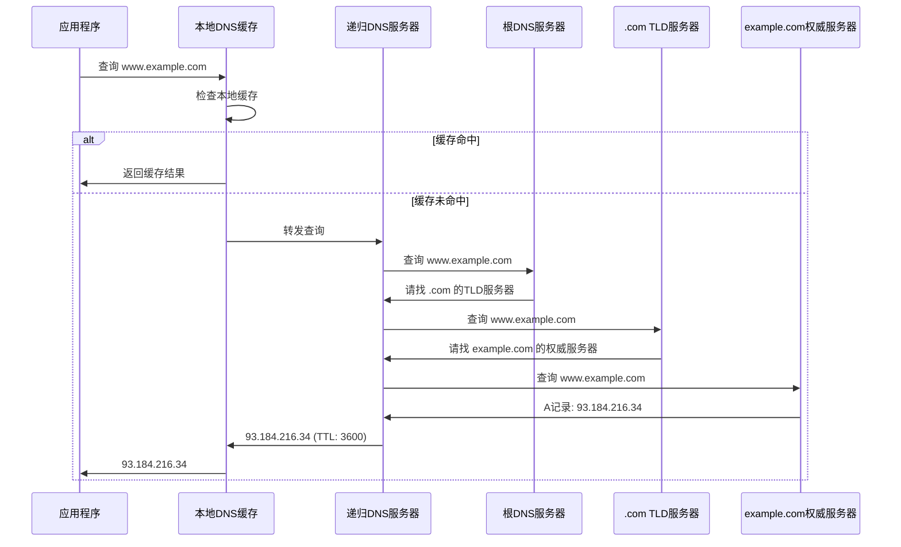
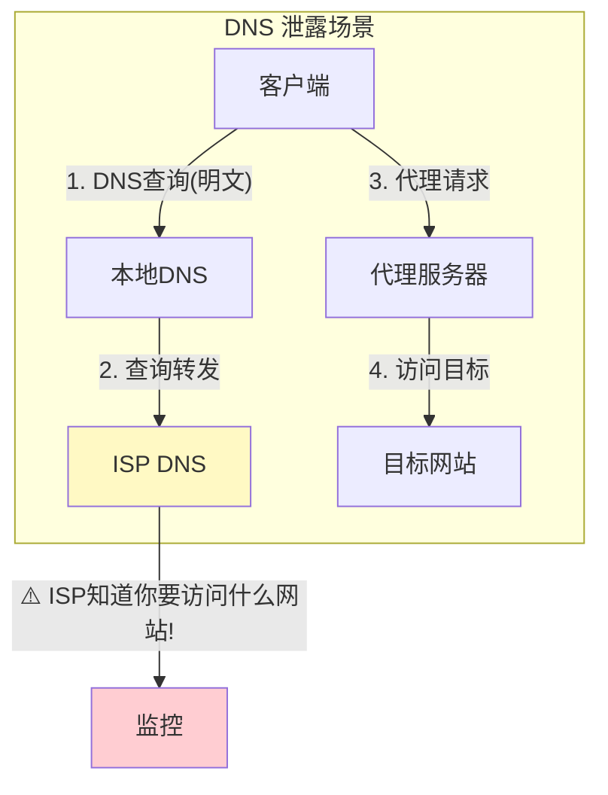
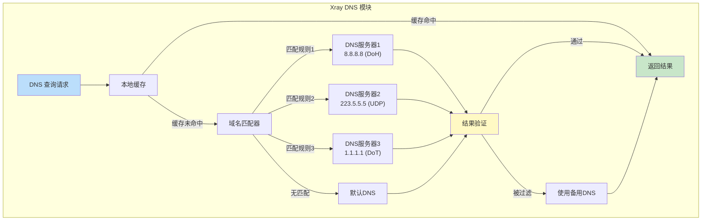

# 第七章：DNS 解析深度解析

> DNS 查询原理、DNS 劫持与防御、Xray DNS 分流策略

## 7.1 DNS 基础

DNS（Domain Name System）将人类可读的域名转换为机器可读的 IP 地址。在代理场景中，DNS 的处理方式直接影响**安全性**和**性能**。

### 7.1.1 DNS 查询过程



### 7.1.2 DNS 报文格式

```
DNS 报文结构:
┌────────────────────────────────────┐
│           Header (12B)             │
│  ID(2B) | Flags(2B) | Counts(8B)  │
├────────────────────────────────────┤
│         Question Section           │
│  QNAME | QTYPE | QCLASS           │
├────────────────────────────────────┤
│         Answer Section             │
│  NAME | TYPE | CLASS | TTL | DATA  │
├────────────────────────────────────┤
│        Authority Section           │
├────────────────────────────────────┤
│       Additional Section           │
└────────────────────────────────────┘

常用记录类型:
  A     (1)  — IPv4 地址
  AAAA  (28) — IPv6 地址
  CNAME (5)  — 别名
  MX    (15) — 邮件服务器
  TXT   (16) — 文本记录
  SRV   (33) — 服务发现
```

## 7.2 DNS 在代理场景中的安全风险

### 7.2.1 DNS 泄露



```go
// DNS 泄露的根本原因
// 应用程序在发起代理连接之前，先用本地 DNS 解析了域名

// 错误流程 (DNS 泄露):
func wrongWay(domain string) {
    // 步骤1: 先用系统 DNS 解析 ← 泄露！
    ips, _ := net.LookupHost(domain)

    // 步骤2: 再通过代理连接
    proxyConn.Connect(ips[0])
}

// 正确流程 (域名直接传给代理):
func rightWay(domain string) {
    // 步骤1: 将域名直接传给代理服务器
    // DNS 解析在远程进行，本地不泄露
    proxyConn.ConnectByDomain(domain)
}

// 设计要点：
// 代理客户端应该支持 SOCKS5 的域名模式
// 或使用 Fake IP / 透明代理来避免 DNS 泄露
```

### 7.2.2 DNS 劫持

```go
// DNS 劫持：中间人篡改 DNS 响应
// 返回错误的 IP 地址

// 劫持示例：
// 查询: www.google.com
// 正常响应: 142.250.80.46
// 劫持响应: 127.0.0.1 或 某个审查页面的IP

// 检测 DNS 劫持的方法
func detectDNSHijacking(domain string) (bool, error) {
    // 方法1: 查询不存在的域名
    // 正常应返回 NXDOMAIN，劫持会返回一个 IP
    _, err := net.LookupHost("this-domain-should-not-exist-12345.com")
    if err == nil {
        return true, nil  // 不存在的域名竟然解析成功 → 被劫持
    }

    // 方法2: 比较多个 DNS 服务器的结果
    googleDNS := queryDNS(domain, "8.8.8.8")
    localDNS := queryDNS(domain, "系统DNS")
    if !sameResult(googleDNS, localDNS) {
        return true, nil  // 结果不一致 → 可能被劫持
    }

    return false, nil
}
```

## 7.3 Xray DNS 模块

### 7.3.1 DNS 模块架构



### 7.3.2 DNS 分流实现

```go
// Xray DNS 分流 — 不同域名使用不同 DNS 服务器
// 路径: app/dns/ (简化)

type DNSClient struct {
    hosts       map[string]net.IP    // 静态域名映射
    servers     []*NameServer        // DNS 服务器列表
    domainRules map[string]int       // 域名 → 服务器索引
    cache       *DNSCache            // DNS 缓存
}

type NameServer struct {
    Address      string       // DNS 服务器地址
    Protocol     string       // 查询协议: udp/tcp/doh/dot/doq
    Domains      []string     // 负责的域名列表
    ExpectIPs    []string     // 期望的 IP 范围（用于过滤）
    SkipFallback bool         // 是否跳过回退
}

func (c *DNSClient) LookupIP(domain string) ([]net.IP, error) {
    // 步骤1: 检查静态映射
    if ip, ok := c.hosts[domain]; ok {
        return []net.IP{ip}, nil
    }

    // 步骤2: 检查缓存
    if ips, found := c.cache.Get(domain); found {
        return ips, nil
    }

    // 步骤3: 找到负责此域名的 DNS 服务器
    server := c.matchServer(domain)

    // 步骤4: 执行 DNS 查询
    ips, err := server.Query(domain)
    if err != nil {
        return nil, err
    }

    // 步骤5: 验证结果
    // 过滤掉不在期望范围内的 IP（防止 DNS 污染）
    filteredIPs := c.filterIPs(ips, server.ExpectIPs)

    if len(filteredIPs) == 0 && !server.SkipFallback {
        // 所有结果都被过滤 → 使用下一个 DNS 服务器
        return c.fallbackQuery(domain)
    }

    // 步骤6: 缓存结果
    c.cache.Put(domain, filteredIPs, ttl)

    return filteredIPs, nil
}

// 域名匹配：确定使用哪个 DNS 服务器
func (c *DNSClient) matchServer(domain string) *NameServer {
    for i, server := range c.servers {
        for _, rule := range server.Domains {
            if matchDomain(domain, rule) {
                return server
            }
        }
    }
    return c.servers[len(c.servers)-1]  // 默认服务器
}
```

### 7.3.3 DNS 查询协议

```go
// 不同的 DNS 查询协议实现

// 1. 传统 UDP DNS (端口 53)
// 优点：速度快    缺点：明文传输，易被劫持
func queryUDP(server, domain string) ([]net.IP, error) {
    conn, _ := net.Dial("udp", server+":53")
    msg := buildDNSQuery(domain)
    conn.Write(msg)
    // 响应可能被篡改！
    return parseDNSResponse(conn)
}

// 2. DNS over HTTPS (DoH)
// 优点：加密传输，不易被识别  缺点：稍慢
func queryDoH(serverURL, domain string) ([]net.IP, error) {
    // 使用 HTTPS POST 发送 DNS 查询
    msg := buildDNSQuery(domain)
    resp, _ := http.Post(serverURL, "application/dns-message",
        bytes.NewReader(msg))
    // 完全加密，中间人无法看到查询内容
    return parseDNSResponse(resp.Body)
}

// 3. DNS over TLS (DoT)
// 优点：加密传输  缺点：使用固定端口 853，易被识别
func queryDoT(server, domain string) ([]net.IP, error) {
    conn, _ := tls.Dial("tcp", server+":853", tlsConfig)
    msg := buildDNSQuery(domain)
    conn.Write(prependLength(msg))  // TCP DNS 需要长度前缀
    return parseDNSResponse(conn)
}

// 4. DNS over QUIC (DoQ)
// 优点：加密+低延迟  缺点：新协议，支持度有限
func queryDoQ(server, domain string) ([]net.IP, error) {
    session, _ := quic.Dial(server+":853", tlsConfig, quicConfig)
    stream, _ := session.OpenStream()
    msg := buildDNSQuery(domain)
    stream.Write(msg)
    return parseDNSResponse(stream)
}

// 各协议对比:
// ┌──────┬────────┬────────────┬─────────────────┐
// │协议  │ 加密   │ 可被识别   │ 抗劫持          │
// ├──────┼────────┼────────────┼─────────────────┤
// │UDP   │  ✗    │  ✓(端口53) │  ✗             │
// │DoH   │  ✓    │  ✗(像HTTPS)│  ✓             │
// │DoT   │  ✓    │  ✓(端口853)│  ✓             │
// │DoQ   │  ✓    │  部分      │  ✓             │
// └──────┴────────┴────────────┴─────────────────┘
```

## 7.4 Fake IP 技术

```go
// Fake IP — 使用假的 IP 地址避免 DNS 泄露
// 在透明代理场景中特别有用

type FakeDNS struct {
    pool     net.IPNet        // 假 IP 地址池 (如 198.18.0.0/15)
    mapping  map[string]net.IP // 域名 → 假IP 映射
    reverse  map[string]string // 假IP → 域名 反向映射
    nextIP   net.IP            // 下一个可分配的假 IP
}

func (f *FakeDNS) Resolve(domain string) net.IP {
    // 步骤1: 检查是否已分配
    if ip, ok := f.mapping[domain]; ok {
        return ip
    }

    // 步骤2: 分配一个新的假 IP
    fakeIP := f.allocateNextIP()
    f.mapping[domain] = fakeIP
    f.reverse[fakeIP.String()] = domain

    return fakeIP
}

// 当代理收到连接请求时
func (f *FakeDNS) HandleConnection(destIP net.IP) {
    // 通过反向映射找到原始域名
    domain := f.reverse[destIP.String()]

    // 使用域名（而不是 IP）进行代理连接
    // 这样真正的 DNS 解析在远程服务器进行
    proxy.ConnectByDomain(domain)
}

// Fake IP 的工作流程:
// 1. 应用程序查询 DNS → Fake DNS 返回假 IP (198.18.x.x)
// 2. 应用程序连接假 IP
// 3. 透明代理截获连接
// 4. 通过反向映射恢复原始域名
// 5. 使用域名通过代理连接 → DNS 在远程解析
//
// 结果: 本地 DNS 只返回假地址，真正的解析在远程进行
//       彻底消除了 DNS 泄露
```

## 7.5 DNS 配置示例

```json
{
    "dns": {
        "hosts": {
            "dns.google": "8.8.8.8"
        },
        "servers": [
            {
                "address": "https://dns.google/dns-query",
                "domains": ["geosite:geolocation-!cn"],
                "expectIPs": ["geoip:!cn"]
            },
            {
                "address": "223.5.5.5",
                "domains": ["geosite:cn"],
                "expectIPs": ["geoip:cn"]
            },
            "localhost"
        ]
    }
}
```

```
DNS 分流逻辑解读：
┌────────────────────────────────────────────────────────┐
│ 1. 非中国域名 → Google DoH 查询                        │
│    → 结果必须是非中国IP（expectIPs 过滤）               │
│    → 防止 DNS 污染返回假的中国 IP                       │
│                                                        │
│ 2. 中国域名 → 阿里 DNS 查询                            │
│    → 结果必须是中国IP                                   │
│    → 确保国内域名解析到最近的服务器                      │
│                                                        │
│ 3. 其他域名 → 本地 DNS                                 │
│    → 兜底策略                                           │
└────────────────────────────────────────────────────────┘
```

## 💡 本章思考题

1. 为什么说 DNS 是代理安全中最容易被忽视的环节？
2. DoH 和 DoT 各有什么优缺点？在什么场景下选择哪个？
3. Fake IP 技术有什么局限性？
4. 如何设计一个 DNS 配置来同时保证安全性和访问速度？

---
[← 上一章：应用层协议](./06-application-layer.md) | [下一章：路由引擎深度解析 →](./08-routing-deep-dive.md)
