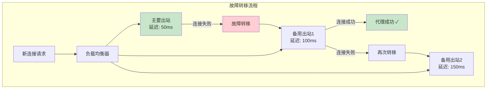

# 第八章：路由引擎深度解析

> 规则匹配优化、域名策略、负载均衡与故障转移

## 8.1 路由引擎的核心挑战

路由引擎需要对每一个新连接做出快速决策。当规则数量达到数千甚至数万条时，性能优化变得至关重要。

### 8.1.1 规则匹配的性能问题

```go
// 朴素实现：逐条遍历所有规则
// 时间复杂度: O(N * M)，N=规则数，M=每条规则的匹配条件数
func naiveMatch(ctx *RoutingContext, rules []*Rule) *Rule {
    for _, rule := range rules {
        if rule.Match(ctx) {   // 可能涉及字符串匹配、CIDR查找等
            return rule
        }
    }
    return nil
}

// 问题：如果有 10000 条规则，每个新连接都要遍历最多 10000 次
// 在高并发场景下这是不可接受的
```

### 8.1.2 域名匹配优化：Trie 树

```go
// 使用 Trie (前缀树) 优化域名匹配
// 将 O(N) 的线性搜索优化为 O(L)，L=域名标签数

// 域名 Trie 树结构
// 注意：域名是从右到左匹配的（先匹配 TLD）
type DomainTrie struct {
    root *TrieNode
}

type TrieNode struct {
    children map[string]*TrieNode  // 子节点（域名标签）
    tag      string                // 匹配此节点的出站标签
    isFull   bool                  // 是否是完整域名匹配
}

// 插入域名规则
func (t *DomainTrie) Insert(domain string, tag string, matchType string) {
    // 将域名拆分为标签并反转
    // "www.google.com" → ["com", "google", "www"]
    labels := reverseDomainLabels(domain)

    node := t.root
    for _, label := range labels {
        if node.children[label] == nil {
            node.children[label] = &TrieNode{
                children: make(map[string]*TrieNode),
            }
        }
        node = node.children[label]
    }

    switch matchType {
    case "domain":
        // "domain:google.com" — 匹配 google.com 及其所有子域名
        node.tag = tag
    case "full":
        // "full:www.google.com" — 仅精确匹配
        node.tag = tag
        node.isFull = true
    }
}

// 查询域名
func (t *DomainTrie) Lookup(domain string) (string, bool) {
    labels := reverseDomainLabels(domain)
    node := t.root
    var lastMatch string

    for _, label := range labels {
        child, ok := node.children[label]
        if !ok {
            break
        }
        node = child
        if node.tag != "" && !node.isFull {
            lastMatch = node.tag  // 子域名匹配
        }
    }

    // 检查完整匹配
    if node.tag != "" && node.isFull && len(labels) == depth(node) {
        return node.tag, true
    }

    if lastMatch != "" {
        return lastMatch, true
    }

    return "", false
}

// 示例：
// Trie 树结构（插入 domain:google.com, domain:github.com）
//
//         root
//          │
//         com
//        /   \
//   google   github
//   (proxy)  (direct)
//
// 查询 "maps.google.com":
// com → google → 匹配! → 返回 "proxy"
//
// 查询 "api.github.com":
// com → github → 匹配! → 返回 "direct"
//
// 时间复杂度: O(域名标签数) ≈ O(3-5)，与规则数无关！
```

### 8.1.3 IP 匹配优化：CIDR 排序 + 二分查找

```go
// IP 匹配使用排序的 CIDR 列表 + 二分查找
// 时间复杂度: O(log N)

type CIDRMatcher struct {
    cidrs []CIDREntry  // 按起始 IP 排序
}

type CIDREntry struct {
    StartIP net.IP
    EndIP   net.IP
    Tag     string
}

// 构建匹配器时排序
func NewCIDRMatcher(entries []CIDREntry) *CIDRMatcher {
    sort.Slice(entries, func(i, j int) bool {
        return bytes.Compare(entries[i].StartIP, entries[j].StartIP) < 0
    })
    return &CIDRMatcher{cidrs: entries}
}

// 二分查找匹配
func (m *CIDRMatcher) Match(ip net.IP) (string, bool) {
    // 找到最后一个 StartIP <= ip 的条目
    idx := sort.Search(len(m.cidrs), func(i int) bool {
        return bytes.Compare(m.cidrs[i].StartIP, ip) > 0
    }) - 1

    if idx >= 0 && bytes.Compare(ip, m.cidrs[idx].EndIP) <= 0 {
        return m.cidrs[idx].Tag, true
    }
    return "", false
}

// 性能对比:
// GeoIP CN 约有 8000+ CIDR 条目
// 朴素遍历: 平均检查 4000 条 → O(4000)
// 二分查找: 最多检查 13 次 → O(13)  快 ~300 倍
```

## 8.2 高级路由策略

### 8.2.1 负载均衡

```go
// 路由级别的负载均衡
// 路径: app/router/balancing.go (简化)

type Balancer struct {
    selectors  []string           // 出站标签选择器
    strategy   BalancingStrategy  // 负载均衡策略
    outbounds  []*Outbound        // 可用的出站列表
}

// 策略1: 轮询 (Round Robin)
type RoundRobinStrategy struct {
    counter uint64
}

func (s *RoundRobinStrategy) Pick(outbounds []*Outbound) *Outbound {
    idx := atomic.AddUint64(&s.counter, 1) % uint64(len(outbounds))
    return outbounds[idx]
}

// 策略2: 最少连接数 (Least Connections)
type LeastConnStrategy struct{}

func (s *LeastConnStrategy) Pick(outbounds []*Outbound) *Outbound {
    var best *Outbound
    minConn := int64(math.MaxInt64)
    for _, ob := range outbounds {
        if ob.ActiveConnections() < minConn {
            minConn = ob.ActiveConnections()
            best = ob
        }
    }
    return best
}

// 策略3: 最低延迟 (Least Latency)
type LeastLatencyStrategy struct {
    probeInterval time.Duration
    latencies     map[string]time.Duration
}

func (s *LeastLatencyStrategy) Pick(outbounds []*Outbound) *Outbound {
    var best *Outbound
    minLatency := time.Duration(math.MaxInt64)
    for _, ob := range outbounds {
        lat := s.latencies[ob.Tag]
        if lat < minLatency {
            minLatency = lat
            best = ob
        }
    }
    return best
}

// 延迟探测
func (s *LeastLatencyStrategy) probe(ob *Outbound) {
    start := time.Now()
    conn, err := ob.Dial("tcp", "www.google.com:443")
    if err != nil {
        s.latencies[ob.Tag] = time.Duration(math.MaxInt64) // 标记为不可用
        return
    }
    conn.Close()
    s.latencies[ob.Tag] = time.Since(start)
}
```

### 8.2.2 故障转移



```go
// 故障转移实现
type FailoverRouter struct {
    outbounds   []*Outbound      // 按优先级排序的出站列表
    healthCheck *HealthChecker   // 健康检查器
}

func (r *FailoverRouter) Route(ctx *RoutingContext) (*Outbound, error) {
    for _, ob := range r.outbounds {
        // 跳过不健康的出站
        if !r.healthCheck.IsHealthy(ob.Tag) {
            continue
        }

        // 尝试连接
        conn, err := ob.Dial(ctx.Target)
        if err != nil {
            // 连接失败，标记为不健康
            r.healthCheck.MarkUnhealthy(ob.Tag)
            continue  // 尝试下一个
        }

        return ob, nil
    }
    return nil, errors.New("所有出站均不可用")
}

// 健康检查
type HealthChecker struct {
    interval    time.Duration
    status      map[string]*HealthStatus
}

type HealthStatus struct {
    Healthy        bool
    LastCheck      time.Time
    FailCount      int
    RecoveryAfter  time.Duration  // 标记不健康后的恢复时间
}

func (h *HealthChecker) StartChecking() {
    ticker := time.NewTicker(h.interval)
    go func() {
        for range ticker.C {
            for tag, status := range h.status {
                // 执行健康检查（TCP 连接测试）
                healthy := h.probe(tag)
                if healthy {
                    status.FailCount = 0
                    status.Healthy = true
                } else {
                    status.FailCount++
                    if status.FailCount >= 3 {
                        // 连续 3 次失败才标记为不健康
                        // 避免偶尔的网络抖动导致频繁切换
                        status.Healthy = false
                    }
                }
            }
        }
    }()
}
```

## 8.3 协议嗅探（Protocol Sniffing）

```go
// 协议嗅探 — 从连接的前几个字节识别应用层协议
// 用于：即使客户端发送的是 IP 地址，也能通过嗅探获取域名
// 路径: app/proxyman/inbound/ (简化)

type Sniffer struct {
    sniffers []ProtocolSniffer
}

type ProtocolSniffer interface {
    Sniff(data []byte) (string, string, error)
    // 返回: (协议名, 域名, 错误)
}

// TLS 嗅探器 — 从 ClientHello 中提取 SNI
type TLSSniffer struct{}

func (s *TLSSniffer) Sniff(data []byte) (string, string, error) {
    // TLS 记录头检查
    if len(data) < 5 || data[0] != 0x16 { // 0x16 = Handshake
        return "", "", ErrNotTLS
    }

    // 解析 ClientHello
    hello, err := parseClientHello(data)
    if err != nil {
        return "", "", err
    }

    // 从 SNI 扩展中提取服务器名
    for _, ext := range hello.Extensions {
        if ext.Type == 0x0000 { // SNI extension
            serverName := parseSNI(ext.Data)
            return "tls", serverName, nil
        }
    }

    return "tls", "", nil
}

// HTTP 嗅探器 — 从 HTTP 请求中提取 Host 头
type HTTPSniffer struct{}

func (s *HTTPSniffer) Sniff(data []byte) (string, string, error) {
    // 检查是否是 HTTP 请求方法
    methods := []string{"GET ", "POST ", "PUT ", "DELETE ", "HEAD "}
    isHTTP := false
    for _, m := range methods {
        if bytes.HasPrefix(data, []byte(m)) {
            isHTTP = true
            break
        }
    }
    if !isHTTP {
        return "", "", ErrNotHTTP
    }

    // 解析 Host 头
    lines := bytes.Split(data, []byte("\r\n"))
    for _, line := range lines {
        if bytes.HasPrefix(bytes.ToLower(line), []byte("host: ")) {
            host := string(line[6:])
            return "http", host, nil
        }
    }

    return "http", "", nil
}

// 嗅探的使用场景:
// 1. 透明代理 — 只知道目标 IP，通过嗅探获取域名用于路由
// 2. 域名路由 — 基于实际访问的域名（而不是连接目标）做路由
// 3. 审计/日志 — 记录实际访问的网站
```

## 8.4 路由配置最佳实践

```json
{
    "routing": {
        "domainStrategy": "IPIfNonMatch",
        "domainMatcher": "hybrid",
        "rules": [
            {"type": "field", "protocol": ["bittorrent"], "outboundTag": "direct"},
            {"type": "field", "domain": ["geosite:category-ads-all"], "outboundTag": "block"},
            {"type": "field", "domain": ["geosite:cn"], "outboundTag": "direct"},
            {"type": "field", "ip": ["geoip:cn", "geoip:private"], "outboundTag": "direct"},
            {"type": "field", "network": "tcp,udp", "outboundTag": "proxy"}
        ],
        "balancers": [
            {
                "tag": "proxy-balancer",
                "selector": ["proxy-"],
                "strategy": {
                    "type": "leastPing"
                }
            }
        ]
    }
}
```

```
规则设计原则：
1. 最具体的规则放在最前面
2. 阻断规则（广告/恶意网站）最先处理
3. 已知分类域名次之（国内/国外）
4. IP 规则放在域名规则之后（配合 IPIfNonMatch）
5. 兜底规则放在最后

性能优化原则：
1. 使用 "hybrid" 域名匹配器（混合线性+Trie）
2. 合理使用 GeoIP/GeoSite 减少规则数量
3. 避免过多的正则表达式规则
4. 利用协议嗅探减少 DNS 查询
```

## 💡 本章思考题

1. Trie 树如何优化域名匹配性能？它的空间复杂度是多少？
2. 负载均衡的"最低延迟"策略有什么缺陷？如何改进？
3. 协议嗅探在透明代理中扮演什么角色？
4. 如何设计一个路由规则来实现"分流 + 负载均衡 + 故障转移"？

---
[← 上一章：DNS 深度解析](./07-dns-deep-dive.md) | [下一章：TLS 与证书深度解析 →](./09-tls-certificate-deep-dive.md)
