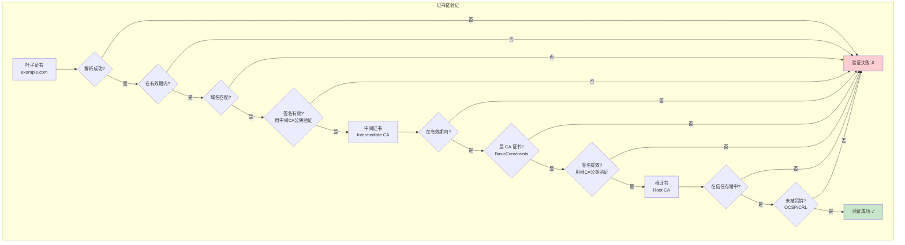
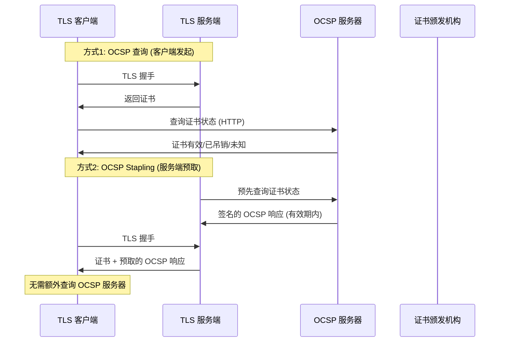

# 第九章：TLS 与证书深度解析

> 证书链验证、OCSP、指纹伪装、以及 ECH 的未来

## 9.1 X.509 证书深度解析

### 9.1.1 证书结构

```go
// X.509 v3 证书的完整结构
// Go 标准库中的表示: crypto/x509

type Certificate struct {
    // === 基本信息 ===
    Version      int           // 证书版本 (通常为 3)
    SerialNumber *big.Int      // 序列号 (全局唯一)

    // === 签名信息 ===
    SignatureAlgorithm SignatureAlgorithm // 签名算法
    // 常见: SHA256WithRSA, ECDSAWithSHA256

    // === 颁发者和主体 ===
    Issuer  pkix.Name  // 颁发者 (CA)
    Subject pkix.Name  // 主体 (证书持有者)

    // === 有效期 ===
    NotBefore time.Time  // 生效时间
    NotAfter  time.Time  // 过期时间

    // === 公钥 ===
    PublicKeyAlgorithm PublicKeyAlgorithm
    PublicKey          interface{} // RSA/ECDSA/Ed25519 公钥

    // === 扩展 (Extensions) ===
    // 扩展是 X.509 v3 的核心，定义了证书的用途和约束

    // 基本约束: 是否是 CA 证书
    IsCA                  bool
    MaxPathLen            int

    // 密钥用途
    KeyUsage              KeyUsage
    // DigitalSignature, KeyEncipherment, CertSign...

    // 扩展密钥用途
    ExtKeyUsage           []ExtKeyUsage
    // ServerAuth, ClientAuth, CodeSigning...

    // 主体替代名称 (SAN) — 证书绑定的域名列表
    DNSNames              []string    // 域名
    IPAddresses           []net.IP    // IP 地址
    EmailAddresses        []string    // 邮箱

    // 证书策略
    PolicyIdentifiers     []asn1.ObjectIdentifier

    // CRL 分发点
    CRLDistributionPoints []string

    // OCSP 服务器地址
    OCSPServer            []string

    // 颁发者信息访问
    IssuingCertificateURL []string
}
```

### 9.1.2 证书链验证的完整流程



```go
// 完整的证书链验证代码
func fullCertificateVerification(
    rawCerts [][]byte,
    serverName string,
) error {

    // 步骤1: 解析所有证书
    certs := make([]*x509.Certificate, len(rawCerts))
    for i, raw := range rawCerts {
        cert, err := x509.ParseCertificate(raw)
        if err != nil {
            return fmt.Errorf("证书 #%d 解析失败: %w", i, err)
        }
        certs[i] = cert
    }

    leaf := certs[0]

    // 步骤2: 验证有效期
    now := time.Now()
    if now.Before(leaf.NotBefore) {
        return fmt.Errorf("证书尚未生效，生效时间: %v", leaf.NotBefore)
    }
    if now.After(leaf.NotAfter) {
        return fmt.Errorf("证书已过期，过期时间: %v", leaf.NotAfter)
    }

    // 步骤3: 验证域名匹配
    // SAN (Subject Alternative Name) 优先于 CN (Common Name)
    if err := leaf.VerifyHostname(serverName); err != nil {
        return fmt.Errorf("域名不匹配: %w", err)
    }

    // 步骤4: 验证密钥用途
    if leaf.KeyUsage&x509.KeyUsageDigitalSignature == 0 {
        return errors.New("证书不支持数字签名")
    }

    hasServerAuth := false
    for _, usage := range leaf.ExtKeyUsage {
        if usage == x509.ExtKeyUsageServerAuth {
            hasServerAuth = true
            break
        }
    }
    if !hasServerAuth {
        return errors.New("证书不支持服务器认证")
    }

    // 步骤5: 构建中间证书池
    intermediates := x509.NewCertPool()
    for _, cert := range certs[1:] {
        intermediates.AddCert(cert)
    }

    // 步骤6: 验证证书链（回溯到受信任的根证书）
    opts := x509.VerifyOptions{
        DNSName:       serverName,
        Intermediates: intermediates,
        CurrentTime:   now,
    }

    chains, err := leaf.Verify(opts)
    if err != nil {
        return fmt.Errorf("证书链验证失败: %w", err)
    }

    // 步骤7: OCSP 吊销检查
    if len(leaf.OCSPServer) > 0 {
        if err := checkOCSP(leaf, chains[0][1], leaf.OCSPServer[0]); err != nil {
            return fmt.Errorf("OCSP 检查失败: %w", err)
        }
    }

    return nil
}
```

## 9.2 OCSP：在线证书状态协议

### 9.2.1 OCSP 查询流程



```go
// OCSP Stapling 实现
// 路径: transport/internet/tls/ (简化)

type OCSPStapler struct {
    cert       *x509.Certificate
    issuer     *x509.Certificate
    response   []byte             // 缓存的 OCSP 响应
    nextUpdate time.Time           // 下次需要更新的时间
}

func (s *OCSPStapler) GetStaple() ([]byte, error) {
    // 检查缓存是否有效
    if s.response != nil && time.Now().Before(s.nextUpdate) {
        return s.response, nil
    }

    // 构建 OCSP 请求
    ocspReq, err := ocsp.CreateRequest(s.cert, s.issuer, nil)
    if err != nil {
        return nil, err
    }

    // 发送 OCSP 查询
    resp, err := http.Post(
        s.cert.OCSPServer[0],
        "application/ocsp-request",
        bytes.NewReader(ocspReq),
    )
    if err != nil {
        return nil, err
    }

    // 解析 OCSP 响应
    ocspResp, err := ocsp.ParseResponse(respBody, s.issuer)
    if err != nil {
        return nil, err
    }

    // 检查证书状态
    switch ocspResp.Status {
    case ocsp.Good:
        // 证书有效
        s.response = respBody
        s.nextUpdate = ocspResp.NextUpdate
        return respBody, nil
    case ocsp.Revoked:
        return nil, errors.New("证书已被吊销")
    default:
        return nil, errors.New("OCSP 状态未知")
    }
}

// OCSP Stapling 的优势:
// 1. 减少客户端延迟（不需要额外的 OCSP 查询）
// 2. 保护隐私（OCSP 服务器不知道谁在访问哪个网站）
// 3. 提高可靠性（即使 OCSP 服务器宕机也能工作）
```

## 9.3 TLS 指纹深度分析

### 9.3.1 JA3 指纹

```go
// JA3 指纹 — 通过 ClientHello 的特征生成指纹
// 格式: MD5(TLSVersion,Ciphers,Extensions,EllipticCurves,
//           EllipticCurvePointFormats)

type JA3Fingerprint struct {
    TLSVersion       uint16
    CipherSuites     []uint16
    Extensions       []uint16
    EllipticCurves   []uint16
    PointFormats     []uint8
}

func calculateJA3(hello *ClientHello) string {
    // 步骤1: 提取各字段
    var parts []string

    // TLS 版本
    parts = append(parts, fmt.Sprint(hello.Version))

    // 密码套件列表（用-分隔）
    ciphers := make([]string, len(hello.CipherSuites))
    for i, c := range hello.CipherSuites {
        ciphers[i] = fmt.Sprint(c)
    }
    parts = append(parts, strings.Join(ciphers, "-"))

    // 扩展列表
    exts := make([]string, len(hello.Extensions))
    for i, e := range hello.Extensions {
        exts[i] = fmt.Sprint(e.Type)
    }
    parts = append(parts, strings.Join(exts, "-"))

    // 椭圆曲线
    curves := make([]string, len(hello.SupportedCurves))
    for i, c := range hello.SupportedCurves {
        curves[i] = fmt.Sprint(c)
    }
    parts = append(parts, strings.Join(curves, "-"))

    // 点格式
    formats := make([]string, len(hello.PointFormats))
    for i, f := range hello.PointFormats {
        formats[i] = fmt.Sprint(f)
    }
    parts = append(parts, strings.Join(formats, "-"))

    // 步骤2: 计算 MD5
    raw := strings.Join(parts, ",")
    hash := md5.Sum([]byte(raw))
    return hex.EncodeToString(hash[:])
}

// 不同客户端的 JA3 指纹:
// Chrome 120: e7d705a3286e19ea42f587b344ee6865
// Firefox 121: 579ccef312d18482fc42e2b822ca2430
// Go net/http: 473cd7cb9faa642487833f7f25afe325
//
// 问题: Go 的指纹与浏览器完全不同
// 解决: 使用 uTLS 模拟浏览器指纹
```

### 9.3.2 uTLS 指纹伪装

```go
// uTLS 通过手动构造 ClientHello 来模拟浏览器指纹
// 路径: transport/internet/tls/ (简化)

func dialWithFingerprint(conn net.Conn, config *tls.Config,
    fingerprint string) (*utls.UConn, error) {

    // 选择预定义的浏览器配置
    var helloID utls.ClientHelloID
    switch fingerprint {
    case "chrome":
        helloID = utls.HelloChrome_Auto
    case "firefox":
        helloID = utls.HelloFirefox_Auto
    case "safari":
        helloID = utls.HelloSafari_Auto
    case "ios":
        helloID = utls.HelloIOS_Auto
    case "android":
        helloID = utls.HelloAndroid_11_OkHttp
    case "edge":
        helloID = utls.HelloEdge_Auto
    case "randomized":
        // 随机化 — 每次连接都不一样
        helloID = utls.HelloRandomized
    }

    // 创建 uTLS 连接
    uconn := utls.UClient(conn, &utls.Config{
        ServerName: config.ServerName,
        NextProtos: config.NextProtos,
    }, helloID)

    // 执行握手
    if err := uconn.Handshake(); err != nil {
        return nil, err
    }

    return uconn, nil
}

// uTLS 的工作原理:
// 1. 预定义各浏览器的 ClientHello 模板
// 2. 包括密码套件顺序、扩展列表、曲线参数等
// 3. 生成的 ClientHello 与真实浏览器完全一致
// 4. JA3 指纹匹配真实浏览器
```

## 9.4 ECH：加密客户端Hello

```go
// ECH (Encrypted Client Hello) — TLS 的未来
// 解决 SNI 明文泄露问题

// 当前问题:
// TLS ClientHello 中的 SNI 是明文的
// 中间人可以看到你要连接哪个域名

// ECH 的解决方案:
// 将 ClientHello 中的敏感信息（包括 SNI）加密

// ECH 工作原理:
// 1. 客户端通过 DNS (HTTPS 记录) 获取服务端的 ECH 公钥
// 2. 使用公钥加密 ClientHello 中的敏感部分
// 3. 中间人只能看到 "外层" SNI（通常是 CDN 的域名）
// 4. 真正的 SNI 被加密保护

// ECH 密钥获取 (通过 DNS HTTPS 记录):
// dig example.com TYPE65
// 返回: ech="..." (Base64 编码的 ECH 配置)

type ECHConfig struct {
    PublicKey  []byte   // 服务端公钥 (HPKE)
    PublicName string   // 外层 SNI (如 cloudflare-ech.com)
    CipherSuite uint16  // HPKE 密码套件
}

// ECH 的意义:
// - SNI 不再泄露 → 中间人无法知道你访问哪个网站
// - 配合 DoH → DNS 查询也被加密
// - 实现真正的端到端隐私
//
// 当前状态:
// - Cloudflare 已支持
// - Chrome/Firefox 实验性支持
// - 尚未普及，但代表了未来方向
```

## 9.5 自动证书管理（ACME）

```go
// ACME — 自动证书管理环境
// Let's Encrypt 使用的协议

// 证书自动申请流程:
// 1. 创建账户
// 2. 请求证书
// 3. 完成域名验证挑战
// 4. 获取证书
// 5. 自动续期

type ACMEClient struct {
    accountKey   crypto.PrivateKey
    directoryURL string            // CA 的 ACME 目录
}

func (c *ACMEClient) ObtainCertificate(domain string) (*tls.Certificate, error) {
    // 步骤1: 创建订单
    order, err := c.newOrder(domain)

    // 步骤2: 获取验证挑战
    challenges := order.Authorizations[0].Challenges

    // 步骤3: 完成 HTTP-01 挑战
    // 在 http://domain/.well-known/acme-challenge/TOKEN
    // 放置验证文件
    for _, ch := range challenges {
        if ch.Type == "http-01" {
            serveChallenge(ch.Token, c.keyAuthorization(ch))
            c.respondToChallenge(ch)
        }
    }

    // 步骤4: 等待验证完成
    waitForValidation(order)

    // 步骤5: 提交 CSR 获取证书
    csr := generateCSR(domain)
    cert, err := c.finalize(order, csr)

    return cert, nil
}

// 自动续期
func (c *ACMEClient) autoRenew(cert *tls.Certificate) {
    go func() {
        for {
            // 在证书过期前 30 天续期
            renewTime := cert.Leaf.NotAfter.Add(-30 * 24 * time.Hour)
            time.Sleep(time.Until(renewTime))

            newCert, err := c.ObtainCertificate(cert.Leaf.DNSNames[0])
            if err == nil {
                // 热替换证书（无需重启服务）
                replaceCertificate(cert, newCert)
            }
        }
    }()
}
```

## 💡 本章思考题

1. 为什么证书链中需要中间证书？直接用根证书签发叶子证书不行吗？
2. OCSP Stapling 解决了什么问题？它有什么局限性？
3. JA3 指纹可以被用于什么目的？如何防御基于 JA3 的检测？
4. ECH 能完全解决 SNI 泄露问题吗？还有哪些隐私挑战？

---
[← 上一章：路由引擎深度解析](./08-routing-deep-dive.md) | [下一章：中断与重连机制 →](./10-interruption-reconnection.md)
