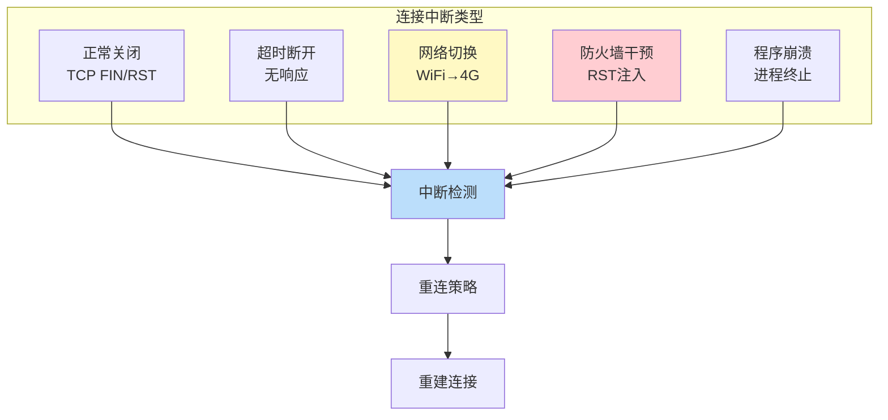
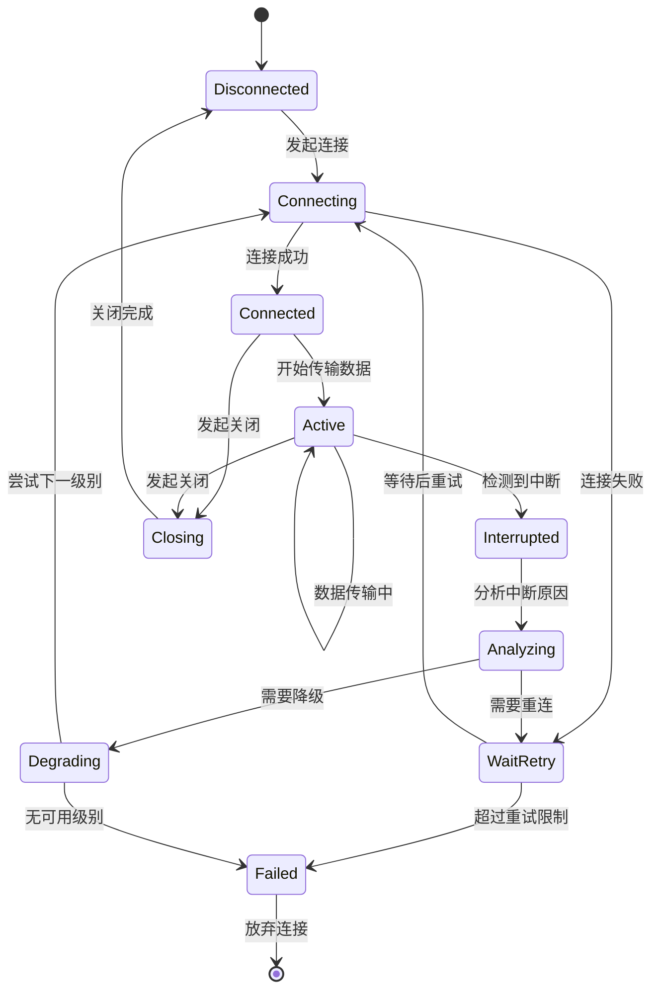

# 第十章：中断与重连机制

> 连接中断检测、优雅降级、重连策略与容错设计

## 10.1 连接中断的类型



### 10.1.1 中断检测机制

```go
// 中断检测的多种方式
// 路径: common/net/ (简化)

// 方式1: TCP 层检测 — 读写错误
func detectReadError(conn net.Conn) {
    buf := make([]byte, 4096)
    n, err := conn.Read(buf)
    if err != nil {
        switch {
        case err == io.EOF:
            // 对端正常关闭连接 (FIN)
            log.Info("连接被对端正常关闭")

        case errors.Is(err, net.ErrClosed):
            // 本地已关闭连接
            log.Info("本地连接已关闭")

        case isConnectionReset(err):
            // 连接被重置 (RST)
            // 可能是防火墙注入的 RST
            log.Warn("连接被重置，可能被干扰")

        case isTimeout(err):
            // 读取超时
            log.Warn("读取超时，连接可能中断")

        default:
            log.Error("未知错误: ", err)
        }
    }
}

func isConnectionReset(err error) bool {
    var opErr *net.OpError
    if errors.As(err, &opErr) {
        var syscallErr *os.SyscallError
        if errors.As(opErr.Err, &syscallErr) {
            return syscallErr.Err == syscall.ECONNRESET
        }
    }
    return false
}

// 方式2: 应用层心跳检测
type HeartbeatDetector struct {
    interval    time.Duration   // 心跳间隔
    timeout     time.Duration   // 超时时间
    missedBeats int             // 允许的连续缺失次数
}

func (h *HeartbeatDetector) Start(conn net.Conn, onDisconnect func()) {
    missedCount := 0
    ticker := time.NewTicker(h.interval)

    go func() {
        for range ticker.C {
            // 发送心跳探测
            conn.SetWriteDeadline(time.Now().Add(h.timeout))
            _, err := conn.Write(heartbeatPayload)

            if err != nil {
                missedCount++
                if missedCount >= h.missedBeats {
                    // 连续多次心跳失败 → 判定连接中断
                    log.Warn("心跳检测失败 %d 次，判定连接中断",
                        missedCount)
                    onDisconnect()
                    return
                }
            } else {
                missedCount = 0  // 重置计数
            }
        }
    }()
}

// 方式3: 防火墙 RST 注入检测
func detectRSTInjection(conn net.Conn) bool {
    // 防火墙 RST 注入的特征:
    // 1. RST 在数据传输过程中突然出现
    // 2. TCP 序号可能不正确
    // 3. 通常在特定关键词出现后立即发生
    // 4. RST 可能来自非预期的 IP (IP 欺骗)

    // 检测策略: 收到 RST 后尝试新连接
    // 如果新连接也立即被 RST → 可能是持续性封锁
    // 如果新连接正常 → 可能是单次 RST 注入
    return false // 简化
}
```

## 10.2 重连策略

### 10.2.1 指数退避重连

```go
// 指数退避重连 — 最常用的重连策略
type ExponentialBackoff struct {
    InitialDelay time.Duration  // 初始延迟 (如 1秒)
    MaxDelay     time.Duration  // 最大延迟 (如 60秒)
    Multiplier   float64        // 退避倍数 (如 2.0)
    Jitter       float64        // 随机抖动比例 (如 0.2)
    MaxRetries   int            // 最大重试次数 (如 10)
}

func (b *ExponentialBackoff) Reconnect(
    dial func() (net.Conn, error)) (net.Conn, error) {

    delay := b.InitialDelay

    for attempt := 0; attempt < b.MaxRetries; attempt++ {
        // 尝试连接
        conn, err := dial()
        if err == nil {
            log.Info("重连成功 (第 %d 次尝试)", attempt+1)
            return conn, nil
        }

        log.Warn("重连失败 (第 %d 次): %v", attempt+1, err)

        // 计算下一次延迟
        // 加入随机抖动防止"惊群效应"
        jitter := delay.Seconds() * b.Jitter *
            (2*rand.Float64() - 1)
        actualDelay := delay + time.Duration(jitter*float64(time.Second))

        log.Info("等待 %v 后重试...", actualDelay)
        time.Sleep(actualDelay)

        // 指数增长延迟
        delay = time.Duration(float64(delay) * b.Multiplier)
        if delay > b.MaxDelay {
            delay = b.MaxDelay
        }
    }

    return nil, errors.New("重连失败: 超过最大重试次数")
}

// 退避延迟序列示例 (初始1s, 倍数2, 最大60s):
// 第1次: ~1s
// 第2次: ~2s
// 第3次: ~4s
// 第4次: ~8s
// 第5次: ~16s
// 第6次: ~32s
// 第7次: ~60s (达到上限)
// 第8次: ~60s
// ...
```

### 10.2.2 智能重连策略

```go
// 智能重连 — 根据中断原因选择不同策略
type SmartReconnector struct {
    strategies map[DisconnectReason]ReconnectStrategy
    history    *ReconnectHistory
}

type DisconnectReason int

const (
    ReasonNormalClose   DisconnectReason = iota
    ReasonTimeout
    ReasonReset         // 可能是防火墙干预
    ReasonNetworkChange // WiFi→4G 切换
    ReasonServerError
)

func (r *SmartReconnector) HandleDisconnect(
    reason DisconnectReason,
    dial func() (net.Conn, error),
) (net.Conn, error) {

    switch reason {
    case ReasonNormalClose:
        // 正常关闭 — 不需要重连
        return nil, errors.New("连接正常关闭")

    case ReasonTimeout:
        // 超时 — 使用标准指数退避
        return exponentialBackoff(dial, 1*time.Second, 60*time.Second)

    case ReasonReset:
        // RST — 可能被干扰，需要切换策略
        log.Warn("检测到连接重置，尝试切换传输方式")

        // 策略1: 切换传输端口
        conn, err := dialWithDifferentPort(dial)
        if err == nil {
            return conn, nil
        }

        // 策略2: 切换传输方式 (TCP → WebSocket)
        conn, err = dialWithWebSocket(dial)
        if err == nil {
            return conn, nil
        }

        // 策略3: 切换服务器
        return dialAlternativeServer(dial)

    case ReasonNetworkChange:
        // 网络切换 — 快速重连（新网络可能已就绪）
        return quickReconnect(dial, 500*time.Millisecond, 3)

    case ReasonServerError:
        // 服务端错误 — 稍后重试
        return exponentialBackoff(dial, 5*time.Second, 300*time.Second)
    }

    return nil, errors.New("未知的断开原因")
}
```

## 10.3 优雅降级

```go
// 优雅降级 — 当主要服务不可用时的备选方案
type GracefulDegrader struct {
    levels []DegradationLevel
    current int
}

type DegradationLevel struct {
    Name       string
    Transport  string         // 传输方式
    Server     string         // 服务器地址
    Protocol   string         // 协议
    Quality    QualityLevel   // 服务质量
}

// 降级层次示例
var degradationLevels = []DegradationLevel{
    {
        Name:      "最优",
        Transport: "tcp",
        Server:    "primary.example.com",
        Protocol:  "vless+reality",
        Quality:   QualityHigh,
    },
    {
        Name:      "备用",
        Transport: "websocket",
        Server:    "ws.example.com",
        Protocol:  "vless+tls",
        Quality:   QualityMedium,
    },
    {
        Name:      "CDN中转",
        Transport: "grpc",
        Server:    "cdn.example.com",
        Protocol:  "vless+tls",
        Quality:   QualityLow,
    },
    {
        Name:      "紧急",
        Transport: "mkcp",
        Server:    "emergency.example.com",
        Protocol:  "vmess",
        Quality:   QualityMinimal,
    },
}

func (d *GracefulDegrader) GetConnection() (net.Conn, error) {
    // 从当前级别开始尝试
    for i := d.current; i < len(d.levels); i++ {
        level := d.levels[i]
        log.Info("尝试降级级别: %s (%s)", level.Name, level.Transport)

        conn, err := connectWithLevel(level)
        if err == nil {
            if i > d.current {
                log.Warn("已降级到: %s", level.Name)
                d.current = i
            }
            return conn, nil
        }
    }
    return nil, errors.New("所有降级级别均不可用")
}

// 定期尝试恢复到更高级别
func (d *GracefulDegrader) TryRecover() {
    go func() {
        ticker := time.NewTicker(5 * time.Minute)
        for range ticker.C {
            if d.current > 0 {
                // 尝试连接更高级别
                level := d.levels[d.current-1]
                conn, err := connectWithLevel(level)
                if err == nil {
                    conn.Close()
                    d.current--
                    log.Info("恢复到级别: %s", level.Name)
                }
            }
        }
    }()
}
```

## 10.4 连接状态机



```go
// 连接状态机实现
type ConnectionState int

const (
    StateDisconnected ConnectionState = iota
    StateConnecting
    StateConnected
    StateActive
    StateInterrupted
    StateAnalyzing
    StateWaitRetry
    StateDegrading
    StateClosing
    StateFailed
)

type ConnectionFSM struct {
    state         ConnectionState
    mu            sync.Mutex
    transitions   map[ConnectionState]map[Event]Transition
    retryCount    int
    degradeLevel  int
}

type Event int
const (
    EventConnect Event = iota
    EventConnected
    EventConnectFail
    EventDataTransfer
    EventInterrupt
    EventAnalyzeComplete
    EventRetryWait
    EventDegrade
    EventClose
    EventMaxRetries
)

type Transition struct {
    NextState ConnectionState
    Action    func() error
}

func NewConnectionFSM() *ConnectionFSM {
    fsm := &ConnectionFSM{
        state: StateDisconnected,
    }

    // 定义状态转换规则
    fsm.transitions = map[ConnectionState]map[Event]Transition{
        StateDisconnected: {
            EventConnect: {StateConnecting, fsm.doConnect},
        },
        StateConnecting: {
            EventConnected:   {StateConnected, fsm.onConnected},
            EventConnectFail: {StateWaitRetry, fsm.scheduleRetry},
        },
        StateConnected: {
            EventDataTransfer: {StateActive, nil},
            EventClose:        {StateClosing, fsm.doClose},
        },
        StateActive: {
            EventInterrupt: {StateInterrupted, fsm.onInterrupt},
            EventClose:     {StateClosing, fsm.doClose},
        },
        StateInterrupted: {
            EventAnalyzeComplete: {StateWaitRetry, fsm.scheduleRetry},
        },
        StateWaitRetry: {
            EventConnect:    {StateConnecting, fsm.doConnect},
            EventDegrade:    {StateDegrading, fsm.doDegrade},
            EventMaxRetries: {StateFailed, fsm.onFailed},
        },
    }

    return fsm
}

func (fsm *ConnectionFSM) Trigger(event Event) error {
    fsm.mu.Lock()
    defer fsm.mu.Unlock()

    transitions, ok := fsm.transitions[fsm.state]
    if !ok {
        return fmt.Errorf("状态 %d 无有效转换", fsm.state)
    }

    transition, ok := transitions[event]
    if !ok {
        return fmt.Errorf("状态 %d 不接受事件 %d", fsm.state, event)
    }

    // 执行转换动作
    if transition.Action != nil {
        if err := transition.Action(); err != nil {
            return err
        }
    }

    // 切换状态
    oldState := fsm.state
    fsm.state = transition.NextState
    log.Info("状态转换: %d → %d", oldState, fsm.state)

    return nil
}
```

## 10.5 连接持久化与恢复

```go
// 连接持久化 — 保存连接状态用于恢复
type ConnectionSnapshot struct {
    ServerAddr    string        `json:"server_addr"`
    Protocol      string        `json:"protocol"`
    Transport     string        `json:"transport"`
    DegradeLevel  int           `json:"degrade_level"`
    RetryCount    int           `json:"retry_count"`
    LastConnected time.Time     `json:"last_connected"`
    SessionToken  string        `json:"session_token"`
}

// 保存状态
func (c *Connection) SaveSnapshot() error {
    snapshot := &ConnectionSnapshot{
        ServerAddr:    c.serverAddr,
        Protocol:      c.protocol,
        Transport:     c.transport,
        DegradeLevel:  c.degradeLevel,
        RetryCount:    c.retryCount,
        LastConnected: time.Now(),
        SessionToken:  c.sessionToken,
    }

    data, _ := json.Marshal(snapshot)
    return os.WriteFile("/tmp/conn_snapshot.json", data, 0600)
}

// 从快照恢复
func RestoreConnection(snapshotPath string) (*Connection, error) {
    data, err := os.ReadFile(snapshotPath)
    if err != nil {
        return nil, err
    }

    var snapshot ConnectionSnapshot
    json.Unmarshal(data, &snapshot)

    // 检查快照是否过期
    if time.Since(snapshot.LastConnected) > 24*time.Hour {
        return nil, errors.New("快照已过期")
    }

    // 从快照恢复连接参数
    conn := &Connection{
        serverAddr:   snapshot.ServerAddr,
        protocol:     snapshot.Protocol,
        transport:    snapshot.Transport,
        degradeLevel: snapshot.DegradeLevel,
    }

    return conn, nil
}
```

## 💡 本章思考题

1. 指数退避的"随机抖动"为什么重要？没有它会发生什么？
2. 如何区分"正常的网络抖动"和"主动干扰"？
3. 优雅降级策略中，如何决定何时尝试恢复到更高级别？
4. 连接状态机的设计中，哪些状态转换最容易出bug？

---
[← 上一章：TLS 与证书深度解析](./09-tls-certificate-deep-dive.md) | [下一章：SuperShield 协议设计 →](./11-supershield-protocol.md)
