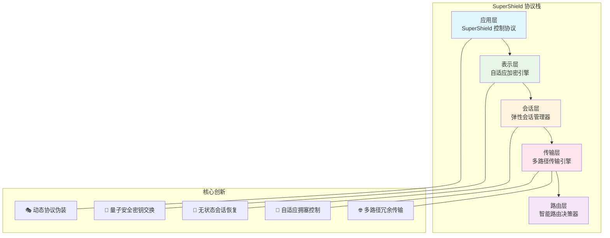
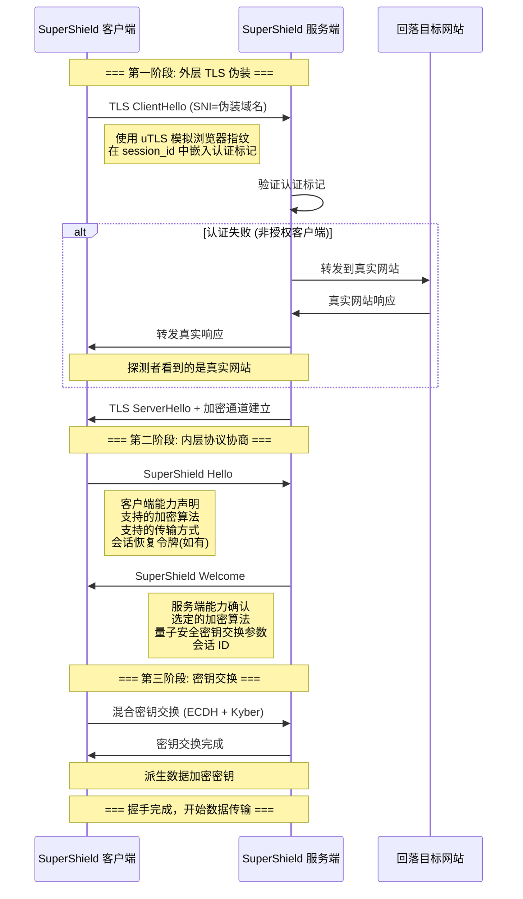
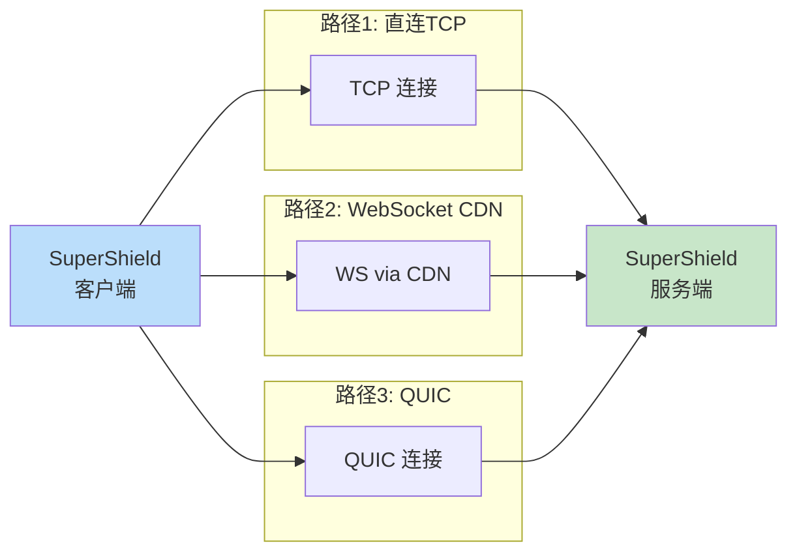
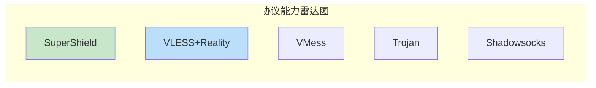

# 第十一章：SuperShield 协议设计

> 融合前十章所有知识，设计一个全新的高可用、高安全性代理协议

## 11.1 设计目标

基于前面章节的分析，现有协议各有优缺点。SuperShield 协议的设计目标是取各家之长：

```
设计目标矩阵:
┌────────────────┬───────────────────────────────────────┐
│ 目标           │ 具体要求                              │
├────────────────┼───────────────────────────────────────┤
│ 高安全性       │ 前向安全、后量子密码学、零信息泄露      │
│ 高可用性       │ 自动重连、优雅降级、多路径冗余          │
│ 高性能         │ 0-RTT连接、零拷贝加密、最小头部开销     │
│ 抗审查性       │ 完美伪装、无可识别特征、主动探测防御     │
│ 易部署性       │ 无需域名/证书、自动配置协商             │
└────────────────┴───────────────────────────────────────┘
```

## 11.2 协议总体架构



## 11.3 握手协议设计

### 11.3.1 设计思路

传统代理协议的握手要么太简单（易被识别），要么太复杂（延迟高）。SuperShield 采用**分层握手**设计：

1. **外层**：看起来像正常的 TLS 1.3 握手（伪装层）
2. **内层**：在 TLS 的加密通道内完成协议特定的认证和能力协商

### 11.3.2 握手流程



### 11.3.3 握手代码实现

```go
// SuperShield 握手协议实现
package supershield

import (
    "crypto/ecdh"
    "crypto/rand"
    "crypto/sha256"
    "encoding/binary"
)

// ===== 协议常量 =====

const (
    ProtocolVersion   = 0x01
    MagicNumber       = 0x5353  // "SS" for SuperShield

    // 握手消息类型
    MsgClientHello    = 0x01
    MsgServerWelcome  = 0x02
    MsgKeyExchange    = 0x03
    MsgKeyConfirm     = 0x04
    MsgSessionResume  = 0x05
)

// ===== 客户端Hello消息 =====

// ClientHello 客户端Hello消息
// 设计思路：声明客户端的能力，让服务端选择最佳方案
type ClientHello struct {
    Version          uint8           // 协议版本
    ClientRandom     [32]byte        // 客户端随机数 — 用于密钥派生
    SessionToken     [32]byte        // 会话恢复令牌 (全零表示新会话)
    Capabilities     Capabilities    // 客户端能力集
    Timestamp        int64           // 时间戳 (加密后传输，防止时钟探测)
}

// Capabilities 能力声明
// 设计思路：面向未来的可扩展设计
type Capabilities struct {
    // 支持的密码套件（按优先级排序）
    CipherSuites     []CipherSuite
    // 支持的传输方式
    Transports       []TransportType
    // 支持的压缩算法
    Compression      []CompressionType
    // 支持的多路复用协议
    MuxProtocols     []MuxProtocol
    // 功能标志
    Flags            CapabilityFlags
}

type CipherSuite uint16
const (
    // 混合后量子密码套件
    CS_ECDH_KYBER768_AES256GCM     CipherSuite = 0x0001
    CS_ECDH_KYBER768_CHACHA20POLY  CipherSuite = 0x0002
    // 经典密码套件（向后兼容）
    CS_ECDH_X25519_AES128GCM       CipherSuite = 0x0101
    CS_ECDH_X25519_CHACHA20POLY    CipherSuite = 0x0102
)

type TransportType uint8
const (
    TransportTCP       TransportType = 0x01
    TransportQUIC      TransportType = 0x02
    TransportWebSocket TransportType = 0x03
    TransportGRPC      TransportType = 0x04
)

type CapabilityFlags uint32
const (
    FlagMultipath    CapabilityFlags = 1 << 0  // 支持多路径
    FlagZeroCopy     CapabilityFlags = 1 << 1  // 支持零拷贝加密
    FlagCompression  CapabilityFlags = 1 << 2  // 支持压缩
    FlagPadding      CapabilityFlags = 1 << 3  // 支持填充
    FlagSessionResume CapabilityFlags = 1 << 4 // 支持会话恢复
)

// ===== 编码/解码 =====

// Encode 编码ClientHello为二进制格式
func (h *ClientHello) Encode() []byte {
    buf := make([]byte, 0, 256)

    // 魔术数字 — 快速识别协议（仅在加密通道内使用）
    buf = binary.BigEndian.AppendUint16(buf, MagicNumber)

    // 消息类型
    buf = append(buf, MsgClientHello)

    // 版本
    buf = append(buf, h.Version)

    // 客户端随机数
    buf = append(buf, h.ClientRandom[:]...)

    // 会话恢复令牌
    buf = append(buf, h.SessionToken[:]...)

    // 能力集（TLV 格式 — 可扩展）
    capBytes := h.Capabilities.Encode()
    buf = binary.BigEndian.AppendUint16(buf, uint16(len(capBytes)))
    buf = append(buf, capBytes...)

    return buf
}

// 设计思路（编码格式）：
// 1. 使用 TLV (Type-Length-Value) 格式保证可扩展性
// 2. 所有多字节字段使用大端序（网络字节序）
// 3. 固定长度字段在前，可变长度在后
// 4. 魔术数字仅在加密通道内出现，不暴露协议特征
```

## 11.4 认证机制设计

### 11.4.1 设计原则

```
认证要求:
1. 零知识 — 中间人无法从网络流量推断认证方式
2. 前向安全 — 即使长期密钥泄露，历史会话仍安全
3. 抗重放 — 捕获的认证信息不能重复使用
4. 无时间依赖 — 不要求客户端和服务端时间严格同步
```

### 11.4.2 认证流程

```go
// SuperShield 使用混合认证方案
// 结合了 Reality 的 TLS 伪装和 VLESS 的 UUID 简洁性

// AuthProvider 认证提供器
type AuthProvider struct {
    // 长期密钥对 (X25519)
    serverPrivateKey  ecdh.PrivateKey
    serverPublicKey   ecdh.PublicKey

    // 授权的客户端列表
    authorizedClients map[[16]byte]*ClientInfo  // UUID → 客户端信息
}

type ClientInfo struct {
    UUID       [16]byte
    PublicKey  ecdh.PublicKey     // 客户端的 X25519 公钥
    ShortIDs   [][8]byte          // 授权的短 ID 列表
    MaxConn    int                // 最大并发连接数
    ExpiresAt  time.Time          // 过期时间
}

// 认证标记生成（客户端侧）
// 嵌入到 TLS ClientHello 的 session_id 字段中
func generateAuthTag(
    clientPrivKey ecdh.PrivateKey,
    serverPubKey ecdh.PublicKey,
    shortID [8]byte,
) [32]byte {

    // 步骤1: ECDH 共享密钥
    // 设计思路: 只有持有正确私钥的客户端才能计算出正确的共享密钥
    sharedSecret, _ := clientPrivKey.ECDH(serverPubKey)

    // 步骤2: 派生认证密钥（使用 HKDF）
    // HKDF 保证即使共享密钥相同，不同用途的派生密钥也不同
    authKey := hkdf.Extract(sha256.New, sharedSecret, []byte("supershield-auth-v1"))

    // 步骤3: 生成认证标记
    // 包含短ID和当前时间窗口（以小时为粒度，允许±1小时误差）
    timeWindow := time.Now().Unix() / 3600  // 小时级别粒度
    h := hmac.New(sha256.New, authKey)
    h.Write(shortID[:])
    binary.Write(h, binary.BigEndian, timeWindow)

    var tag [32]byte
    copy(tag[:], h.Sum(nil))
    return tag

    // 设计思路（为什么这样认证）：
    // 1. ECDH 保证只有合法客户端能生成正确标记
    // 2. shortID 允许一个服务端服务多个客户端
    // 3. 时间窗口用小时粒度，允许较大的时钟偏差
    // 4. 标记看起来像随机数据（符合 TLS session_id 格式）
    // 5. 没有私钥的观察者无法区分这是认证标记还是随机数
}

// 认证验证（服务端侧）
func (a *AuthProvider) Verify(sessionID [32]byte) (*ClientInfo, error) {
    // 遍历所有授权客户端
    for _, client := range a.authorizedClients {
        // 检查过期
        if time.Now().After(client.ExpiresAt) {
            continue
        }

        // 计算共享密钥
        sharedSecret, _ := a.serverPrivateKey.ECDH(client.PublicKey)
        authKey := hkdf.Extract(sha256.New, sharedSecret,
            []byte("supershield-auth-v1"))

        // 检查所有授权的 shortID
        for _, shortID := range client.ShortIDs {
            // 检查当前和相邻时间窗口（±1小时）
            for delta := int64(-1); delta <= 1; delta++ {
                timeWindow := time.Now().Unix()/3600 + delta
                h := hmac.New(sha256.New, authKey)
                h.Write(shortID[:])
                binary.Write(h, binary.BigEndian, timeWindow)

                expectedTag := h.Sum(nil)
                if hmac.Equal(sessionID[:], expectedTag[:32]) {
                    return client, nil
                }
            }
        }
    }

    return nil, ErrUnauthorized
}
```

## 11.5 数据传输协议

### 11.5.1 帧格式设计

```
SuperShield 数据帧格式:
┌─────────────────────────────────────────────────────────┐
│                     帧头 (Header)                        │
├──────┬──────┬──────────┬──────────┬──────────────────────┤
│类型  │标志  │ 流ID     │ 长度     │ 附加数据长度          │
│(4bit)│(4bit)│ (24bit)  │ (16bit)  │ (8bit)              │
├──────┴──────┴──────────┴──────────┴──────────────────────┤
│                  附加数据 (可选，变长)                     │
├─────────────────────────────────────────────────────────┤
│                  载荷 (Payload)                           │
├─────────────────────────────────────────────────────────┤
│                  认证标签 (16 bytes)                      │
└─────────────────────────────────────────────────────────┘

帧头总大小: 7 bytes (极小!)

类型 (4 bit):
  0x0 = 数据帧 (DATA)
  0x1 = 流控帧 (WINDOW_UPDATE)
  0x2 = 新建流 (STREAM_OPEN)
  0x3 = 关闭流 (STREAM_CLOSE)
  0x4 = 心跳帧 (PING)
  0x5 = 心跳响应 (PONG)
  0x6 = 错误帧 (ERROR)
  0x7 = 设置帧 (SETTINGS)
  0x8 = 路径探测 (PATH_PROBE)
  0x9 = 会话恢复 (SESSION_RESUME)

标志 (4 bit):
  bit 0: 是否加密 (用于XTLS零拷贝场景)
  bit 1: 是否压缩
  bit 2: 是否有附加数据
  bit 3: 是否是最后一帧

流ID (24 bit):
  支持最多 16M 个并发流 — 足够任何场景
```

### 11.5.2 帧处理实现

```go
// SuperShield 帧处理
package supershield

// Frame 数据帧
type Frame struct {
    Type      FrameType  // 帧类型
    Flags     uint8      // 标志位
    StreamID  uint32     // 流ID (24位)
    Length    uint16     // 载荷长度
    ExtraLen  uint8      // 附加数据长度
    Extra     []byte     // 附加数据
    Payload   []byte     // 载荷
}

type FrameType uint8
const (
    FrameData         FrameType = 0x0
    FrameWindowUpdate FrameType = 0x1
    FrameStreamOpen   FrameType = 0x2
    FrameStreamClose  FrameType = 0x3
    FramePing         FrameType = 0x4
    FramePong         FrameType = 0x5
    FrameError        FrameType = 0x6
    FrameSettings     FrameType = 0x7
    FramePathProbe    FrameType = 0x8
    FrameSessionResume FrameType = 0x9
)

// 编码帧
func (f *Frame) Encode(key, nonce []byte) ([]byte, error) {
    // 步骤1: 编码帧头 (7 bytes)
    header := make([]byte, 7)
    // 类型(4bit) + 标志(4bit)
    header[0] = byte(f.Type)<<4 | (f.Flags & 0x0F)
    // 流ID (24bit, 大端序)
    header[1] = byte(f.StreamID >> 16)
    header[2] = byte(f.StreamID >> 8)
    header[3] = byte(f.StreamID)
    // 长度 (16bit)
    binary.BigEndian.PutUint16(header[4:6], f.Length)
    // 附加数据长度 (8bit)
    header[6] = f.ExtraLen

    // 步骤2: 组装完整帧
    frame := append(header, f.Extra...)
    frame = append(frame, f.Payload...)

    // 步骤3: AEAD 加密（如果标志位指示加密）
    if f.Flags&0x01 == 0 { // bit 0 = 0 表示需要加密
        block, _ := aes.NewCipher(key)
        gcm, _ := cipher.NewGCM(block)
        // 帧头作为 Additional Data（不加密但要认证）
        frame = gcm.Seal(nil, nonce, frame[7:], header)
        frame = append(header, frame...)
    }

    return frame, nil
}

// 解码帧
func DecodeFrame(data []byte, key, nonce []byte) (*Frame, error) {
    if len(data) < 7 {
        return nil, errors.New("帧太短")
    }

    f := &Frame{}

    // 步骤1: 解析帧头
    f.Type = FrameType(data[0] >> 4)
    f.Flags = data[0] & 0x0F
    f.StreamID = uint32(data[1])<<16 | uint32(data[2])<<8 | uint32(data[3])
    f.Length = binary.BigEndian.Uint16(data[4:6])
    f.ExtraLen = data[6]

    // 步骤2: AEAD 解密（如果加密）
    if f.Flags&0x01 == 0 {
        block, _ := aes.NewCipher(key)
        gcm, _ := cipher.NewGCM(block)
        plaintext, err := gcm.Open(nil, nonce, data[7:], data[:7])
        if err != nil {
            return nil, fmt.Errorf("解密失败: %w", err)
        }
        data = append(data[:7], plaintext...)
    }

    // 步骤3: 提取附加数据和载荷
    offset := 7
    if f.ExtraLen > 0 {
        f.Extra = data[offset : offset+int(f.ExtraLen)]
        offset += int(f.ExtraLen)
    }
    f.Payload = data[offset:]

    return f, nil
}

// 设计思路：
// 1. 帧头仅 7 字节 — 比 HTTP/2 的 9 字节更紧凑
// 2. 类型和标志合并到一个字节 — 减少空间
// 3. 24位流ID — 足够支持海量并发
// 4. AEAD 认证覆盖帧头 — 防止帧头被篡改
// 5. 加密标志位支持零拷贝场景 (类似XTLS Vision)
```

## 11.6 多路径传输

### 11.6.1 设计思路

```
多路径传输的核心思想:
同一个会话的数据可以通过多条网络路径传输

优势:
1. 冗余性 — 一条路径断了，数据自动切换到其他路径
2. 带宽叠加 — 多条路径的带宽可以叠加
3. 延迟优化 — 同一数据发送到多条路径，取最先到达的
4. 负载分散 — 单个连接的流量特征不那么明显
```



### 11.6.2 多路径实现

```go
// 多路径传输引擎
type MultipathEngine struct {
    paths      []*Path
    scheduler  PathScheduler
    reorderer  *PacketReorderer
}

type Path struct {
    ID         uint8
    Transport  TransportType
    Conn       net.Conn
    RTT        time.Duration     // 往返延迟
    Bandwidth  int64             // 估算带宽 (bytes/s)
    Available  bool              // 是否可用
    Priority   int               // 优先级
}

// 路径调度器接口
type PathScheduler interface {
    SelectPath(paths []*Path, data []byte) *Path
}

// 最低延迟调度
type LowLatencyScheduler struct{}

func (s *LowLatencyScheduler) SelectPath(paths []*Path, data []byte) *Path {
    var best *Path
    for _, p := range paths {
        if !p.Available {
            continue
        }
        if best == nil || p.RTT < best.RTT {
            best = p
        }
    }
    return best
}

// 冗余调度（关键数据发送到所有路径）
type RedundantScheduler struct{}

func (s *RedundantScheduler) SelectPath(paths []*Path, data []byte) *Path {
    // 返回 nil 表示发送到所有可用路径
    return nil
}

// 带宽分摊调度
type SplitScheduler struct{}

func (s *SplitScheduler) SelectPath(paths []*Path, data []byte) *Path {
    // 按带宽比例分配流量
    totalBW := int64(0)
    for _, p := range paths {
        if p.Available {
            totalBW += p.Bandwidth
        }
    }

    // 加权随机选择
    r := rand.Int63n(totalBW)
    cumBW := int64(0)
    for _, p := range paths {
        if p.Available {
            cumBW += p.Bandwidth
            if r < cumBW {
                return p
            }
        }
    }
    return paths[0]
}

// 路径探测（定期检测路径健康状态）
func (e *MultipathEngine) ProbePaths() {
    go func() {
        ticker := time.NewTicker(10 * time.Second)
        for range ticker.C {
            for _, path := range e.paths {
                start := time.Now()
                // 发送 PING 帧
                err := sendFrame(path.Conn, &Frame{
                    Type:    FramePing,
                    Payload: randomBytes(8),
                })
                if err != nil {
                    path.Available = false
                    log.Warn("路径 %d 不可用: %v", path.ID, err)

                    // 尝试重建路径
                    go e.rebuildPath(path)
                    continue
                }

                // 等待 PONG 响应
                pong, err := waitForPong(path.Conn, 5*time.Second)
                if err != nil {
                    path.Available = false
                    continue
                }

                path.RTT = time.Since(start)
                path.Available = true
            }
        }
    }()
}
```

## 11.7 会话恢复机制

```go
// 无状态会话恢复 — 快速恢复中断的连接
// 类似 TLS 1.3 的 Session Ticket 机制

type SessionManager struct {
    ticketKey [32]byte     // 会话票据加密密钥
    mu        sync.RWMutex
}

// SessionTicket 会话票据（加密后发给客户端保存）
type SessionTicket struct {
    SessionID    [16]byte          // 会话标识
    CreatedAt    int64             // 创建时间
    ExpiresAt    int64             // 过期时间
    CipherSuite  CipherSuite      // 协商的密码套件
    MasterSecret [32]byte          // 主密钥
    ClientUUID   [16]byte          // 客户端标识
    PathStates   []PathState       // 路径状态（用于多路径恢复）
}

type PathState struct {
    PathID     uint8
    Transport  TransportType
    LastSeqNum uint64              // 最后的序号
}

// 生成会话票据（服务端 → 客户端）
func (sm *SessionManager) IssueTicket(session *Session) ([]byte, error) {
    ticket := &SessionTicket{
        SessionID:    session.ID,
        CreatedAt:    time.Now().Unix(),
        ExpiresAt:    time.Now().Add(24 * time.Hour).Unix(),
        CipherSuite:  session.CipherSuite,
        MasterSecret: session.MasterSecret,
        ClientUUID:   session.ClientUUID,
    }

    // 序列化
    data, _ := json.Marshal(ticket)

    // 使用 AES-256-GCM 加密票据
    // 只有服务端知道 ticketKey，客户端无法解密
    nonce := randomBytes(12)
    block, _ := aes.NewCipher(sm.ticketKey[:])
    gcm, _ := cipher.NewGCM(block)
    encrypted := gcm.Seal(nil, nonce, data, nil)

    // nonce + encrypted
    return append(nonce, encrypted...), nil
}

// 恢复会话（客户端出示票据）
func (sm *SessionManager) ResumeSession(ticketData []byte) (*Session, error) {
    // 解密票据
    nonce := ticketData[:12]
    encrypted := ticketData[12:]

    block, _ := aes.NewCipher(sm.ticketKey[:])
    gcm, _ := cipher.NewGCM(block)
    data, err := gcm.Open(nil, nonce, encrypted, nil)
    if err != nil {
        return nil, errors.New("票据无效或被篡改")
    }

    // 反序列化
    var ticket SessionTicket
    json.Unmarshal(data, &ticket)

    // 检查过期
    if time.Now().Unix() > ticket.ExpiresAt {
        return nil, errors.New("会话票据已过期")
    }

    // 恢复会话
    session := &Session{
        ID:           ticket.SessionID,
        CipherSuite:  ticket.CipherSuite,
        MasterSecret: ticket.MasterSecret,
        ClientUUID:   ticket.ClientUUID,
    }

    return session, nil

    // 设计思路（会话恢复的好处）：
    // 1. 0-RTT 恢复 — 不需要重新握手
    // 2. 无状态 — 服务端不需要存储会话状态
    // 3. 安全 — 票据被加密，只有服务端能解密
    // 4. 防重放 — 可以通过时间戳和使用记录防止重放
}
```

## 11.8 动态协议伪装

```go
// 动态伪装 — 根据网络环境自动选择最佳伪装方式
type DynamicCamouflage struct {
    probes    []CamouflageProbe    // 伪装探测器
    current   CamouflageProfile    // 当前伪装配置
}

type CamouflageProfile struct {
    SNI           string          // 伪装的 SNI 域名
    Fingerprint   string          // TLS 指纹 (浏览器类型)
    ALPN          []string        // ALPN 协议列表
    PaddingRange  [2]int          // 填充大小范围
    TimingJitter  time.Duration   // 时序抖动
}

// 预定义伪装模板
var camouflageProfiles = map[string]CamouflageProfile{
    "https-browsing": {
        SNI:          "www.microsoft.com",
        Fingerprint:  "chrome",
        ALPN:         []string{"h2", "http/1.1"},
        PaddingRange: [2]int{0, 255},
        TimingJitter: 10 * time.Millisecond,
    },
    "video-streaming": {
        SNI:          "cdn.example.com",
        Fingerprint:  "chrome",
        ALPN:         []string{"h2"},
        PaddingRange: [2]int{0, 0},       // 视频流无需填充
        TimingJitter: 0,                  // 视频流时序均匀
    },
    "api-traffic": {
        SNI:          "api.example.com",
        Fingerprint:  "chrome",
        ALPN:         []string{"h2"},
        PaddingRange: [2]int{16, 128},
        TimingJitter: 5 * time.Millisecond,
    },
}

// 流量填充 — 使数据包大小分布与正常 HTTPS 流量一致
func applyPadding(frame *Frame, profile CamouflageProfile) {
    if profile.PaddingRange[1] == 0 {
        return
    }

    // 计算填充大小
    padSize := profile.PaddingRange[0] +
        rand.Intn(profile.PaddingRange[1]-profile.PaddingRange[0])

    // 添加随机填充
    padding := make([]byte, padSize)
    rand.Read(padding)

    frame.Flags |= 0x08  // 设置填充标志
    frame.Extra = append(frame.Extra, byte(padSize))
    frame.Payload = append(frame.Payload, padding...)
    frame.Length += uint16(padSize)
}

// 时序伪装 — 模拟正常浏览行为的发包间隔
func applyTimingJitter(profile CamouflageProfile) {
    if profile.TimingJitter == 0 {
        return
    }

    // 正常 HTTPS 流量的包间隔通常遵循特定分布
    // 添加随机抖动使流量模式更自然
    jitter := time.Duration(rand.Int63n(int64(profile.TimingJitter)))
    time.Sleep(jitter)
}

// 设计思路（动态伪装）：
// 1. 数据包大小分布 — 通过填充使其与正常HTTPS一致
// 2. 发包时序 — 通过抖动模拟浏览器行为
// 3. TLS 指纹 — 使用 uTLS 完美模拟浏览器
// 4. SNI — 使用知名网站的域名
// 5. 自适应 — 根据实际网络环境调整伪装策略
```

## 11.9 配置示例

```json
{
    "supershield": {
        "server": {
            "listen": "0.0.0.0:443",
            "privateKey": "BASE64_ENCODED_X25519_PRIVATE_KEY",
            "shortIds": ["abcdef01", "23456789"],
            "fallback": {
                "dest": "www.microsoft.com:443",
                "xver": 1
            },
            "clients": [
                {
                    "uuid": "550e8400-e29b-41d4-a716-446655440000",
                    "publicKey": "BASE64_ENCODED_X25519_PUBLIC_KEY",
                    "shortIds": ["abcdef01"],
                    "maxConnections": 100
                }
            ]
        },
        "transport": {
            "multipath": true,
            "paths": [
                {"type": "tcp", "priority": 1},
                {"type": "websocket", "path": "/ws", "priority": 2},
                {"type": "quic", "priority": 3}
            ]
        },
        "security": {
            "cipherSuite": "ECDH_KYBER768_AES256GCM",
            "fingerprint": "chrome",
            "padding": true,
            "zeroCopy": true
        },
        "session": {
            "resumption": true,
            "ticketLifetime": "24h"
        },
        "camouflage": {
            "profile": "https-browsing",
            "sni": "www.microsoft.com"
        }
    }
}
```

## 11.10 安全性分析

```
┌──────────────────┬────────────────────────────────────────┐
│ 威胁模型         │ SuperShield 的防御措施                  │
├──────────────────┼────────────────────────────────────────┤
│ 被动监听         │ TLS 1.3 加密 + ECDH 前向安全           │
│ 主动探测         │ 回落到真实网站 + 无可识别特征           │
│ TLS 指纹识别     │ uTLS 浏览器指纹模拟                    │
│ 流量分析         │ 填充 + 时序抖动 + 多路径分散            │
│ 重放攻击         │ 时间窗口 + Nonce + 会话唯一密钥         │
│ 中间人攻击       │ ECDH 认证 + 证书钉扎                   │
│ 量子计算攻击     │ 混合密钥交换 (ECDH + Kyber)            │
│ 连接中断/干扰    │ 多路径冗余 + 自动重连 + 优雅降级        │
│ 密钥泄露         │ 前向安全 + 短期会话密钥                 │
│ DNS 泄露         │ 远程DNS解析 + Fake IP                  │
│ IP 封锁          │ CDN 中转 + 多服务器切换                │
└──────────────────┴────────────────────────────────────────┘
```

## 11.11 与现有协议的对比



```
┌─────────────┬────────┬────────┬────────┬────────┬──────────────┐
│ 能力/协议    │ SS2022 │ VMess  │ Trojan │ VLESS  │ SuperShield  │
│             │        │        │        │+Reality│              │
├─────────────┼────────┼────────┼────────┼────────┼──────────────┤
│ 头部开销     │ 中     │ 大     │ 小     │ 极小   │ 极小(7B)     │
│ 自带加密     │ ✓     │ ✓     │ ✗     │ ✗     │ 自适应       │
│ 多路复用     │ ✗     │ ✗     │ ✗     │ Mux   │ 内置高级Mux  │
│ 抗主动探测   │ 一般   │ 弱     │ 强     │ 强     │ 强           │
│ 多路径       │ ✗     │ ✗     │ ✗     │ ✗     │ ✓           │
│ 会话恢复     │ ✗     │ ✗     │ ✗     │ ✗     │ ✓(0-RTT)    │
│ 后量子安全   │ ✗     │ ✗     │ ✗     │ ✗     │ ✓(Kyber)    │
│ 零拷贝       │ ✗     │ ✗     │ ✗     │ ✓     │ ✓           │
│ 时间依赖     │ 有     │ 强     │ 无     │ 无     │ 弱(小时级)   │
│ 故障转移     │ ✗     │ ✗     │ ✗     │ ✗     │ ✓(自动)     │
└─────────────┴────────┴────────┴────────┴────────┴──────────────┘
```

## 11.12 设计总结

SuperShield 协议的每个设计决策都源于对现有协议优缺点的深入分析：

```
设计决策清单:

1. 认证方式: ECDH + 短ID
   ← 取自 Reality 的认证伪装思想
   ← 改进: 不依赖精确时间同步

2. 加密方式: 自适应 (可选零拷贝)
   ← 取自 XTLS Vision 的零拷贝思想
   ← 改进: 支持后量子密码学

3. 帧格式: 7字节极简帧头
   ← 取自 VLESS 的极简设计哲学
   ← 改进: 内置多路复用支持

4. 伪装方式: 动态伪装 + 回落
   ← 取自 Reality + Trojan 的伪装策略
   ← 改进: 增加流量填充和时序抖动

5. 可用性: 多路径 + 会话恢复 + 故障转移
   ← 取自 QUIC 的多路复用和迁移思想
   ← 改进: 跨传输方式的多路径冗余

6. 可扩展性: TLV 编码 + 能力协商
   ← 面向未来的设计，易于添加新功能
   ← 不影响已有实现的兼容性
```

## 💡 本章思考题

1. SuperShield 的混合密钥交换（ECDH + Kyber）是否引入了额外的攻击面？
2. 多路径传输的包重排序问题应该如何解决？
3. 动态伪装的时序抖动是否可能被统计分析检测出来？
4. 如果要实现 SuperShield，最大的工程挑战是什么？

---
[← 上一章：中断与重连机制](./10-interruption-reconnection.md) | [返回目录 →](./README.md)
